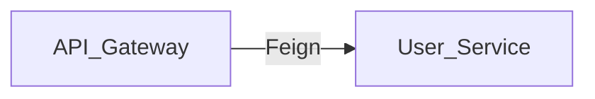

# Documentation Guidelines

This document defines the **mandatory rules** for all documentation in this repository.
Violations will be rejected during code review.

---

## 1. Standard Markdown

- Use **GitHub-Flavored Markdown (GFM)** only.
- File extension: `.md`
- Maximum line length: **120 characters**
- Use `#` headings with a single space after `#`. Do not use underlined headings (`===`, `---`).
- Tables must use GFM pipe syntax.

## 2. Diagram Syntax

- **Mermaid.js** is the ONLY permitted diagramming language.
- Use native Mermaid code blocks:
  ```mermaid
  flowchart LR
    A --> B
  ```
- **Prohibited:** PlantUML, C4-Model DSL, ASCII art diagrams, embedded images for architecture/flow.
- Supported diagram types: `flowchart`, `sequenceDiagram`, `classDiagram`, `stateDiagram-v2`.

## 3. Strict Evidence-Based Extraction (No Hallucination)

Every arrow / edge / relationship in every diagram **MUST** be preceded by a `%% Source:` comment
citing the exact file path and line number from which the relationship was derived.

### Example



### Rules

| Rule | Description |
|------|-------------|
| File path | Relative to repository root. Use the actual path on disk. |
| Line number | Include the line number in the source file where the relationship is defined. |
| One citation per relationship | Every arrow in a diagram must have its own `%% Source:` line. |
| No fabrication | If you cannot find the source for a relationship in the codebase, **do not add it**. |

## 4. File & Folder Naming (kebab-case)

- **All** directories and files must use `kebab-case`.
- Examples: `system-architecture.md`, `reservation-service/`, `event-publisher-flow.md`.
- **Prohibited:** `snake_case`, `camelCase`, `PascalCase`, spaces.
- Exception: `DOCUMENTATION_GUIDELINES.md` and `README.md` (by convention).

---

## Enforcement

- All PRs modifying `docs/` will be checked for compliance.
- Missing `%% Source:` annotations on diagram edges are an automatic **request changes**.
