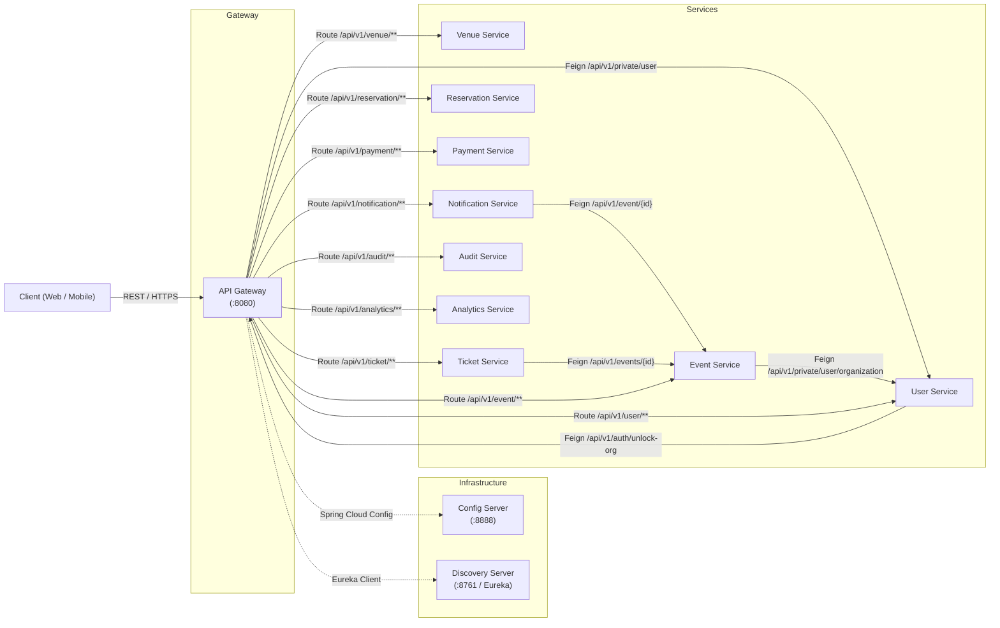
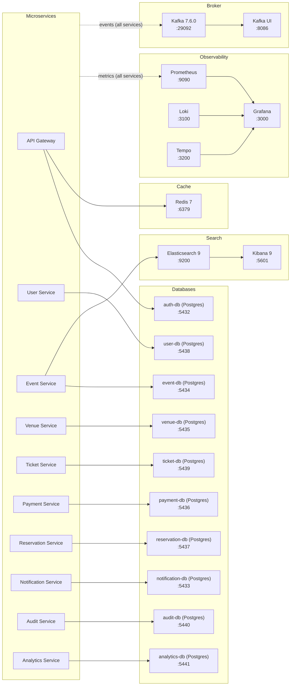

# System Architecture — TicketSouq Backend

> **Note:** All diagrams use native Mermaid `flowchart LR` for GitHub rendering.
> Every arrow is annotated with `%% Source:` pointing to the exact codebase file.

---

## Diagram 1 — Synchronous Flow (REST / Feign)



---

## Diagram 2 — Asynchronous Flow (Kafka)

```mermaid
flowchart LR
  subgraph Producers
    GW_P["API Gateway"]
    US_P["User Service"]
    ES_P["Event Service"]
    RS_P["Reservation Service"]
    PS_P["Payment Service"]
  end

  subgraph Topics["Kafka Topics (grouped by domain)"]
    direction TB
    subgraph AUTH["Auth & Account"]
      direction LR
      T1["user.email-verification"]
      T2["user.password-reset"]
      T3["user.password-change"]
      T4["accounts.generated"]
    end
    subgraph EVT["Event Lifecycle"]
      direction LR
      T5["event.created"]
      T6["event.activated"]
      T7["event.completed"]
      T8["event.cancelled"]
      T22["event.payout-released"]
      T25["organizer.reservation.created"]
      T26["organizer.reservation.cancelled"]
    end
    subgraph SAGA["Reservation / Payment"]
      direction LR
      T11["reservation.begin"]
      T24["reservation.completed"]
      T9["payment.success"]
      T10["payment.refunded"]
      T23["payment.failed"]
    end
    subgraph CMD["Saga Commands & Replies"]
      direction LR
      T12["saga.payment.command"]
      T14["saga.payment.compensate"]
      T15["saga.ticket.command"]
      T17["saga.ticket.compensate"]
      T18["saga.lock.confirm.command"]
      T19["saga.lock.confirm.compensate"]
      T13["saga.payment.reply"]
      T16["saga.ticket.reply"]
      T20["saga.lock.confirm.reply"]
    end
    subgraph SYS["System"]
      direction LR
      T21["audit.event"]
      T27["org.status.changed"]
    end
  end

  subgraph Consumers
    NS_C["Notification Service"]
    AS_C["Audit Service"]
    TS_C["Ticket Service"]
    PS_C["Payment Service"]
    ES_C["Event Service"]
    RS_C["Reservation Service"]
    AnS_C["Analytics Service"]
  end

  %% Source: shared-module/src/main/java/.../Constants/TOPIC_NAMES.java:9-12
  GW_P -->|publishes| T1
  GW_P -->|publishes| T2
  GW_P -->|publishes| T3
  GW_P -->|publishes| T4
  %% Source: api-gateway/src/main/java/.../service/AuthService.java:453 (outbox)
  GW_P -->|publishes| T21

  %% Source: shared-module/src/main/java/.../Constants/TOPIC_NAMES.java:15-19
  ES_P -->|publishes| T5
  ES_P -->|publishes| T6
  ES_P -->|publishes| T7
  ES_P -->|publishes| T8
  %% Source: event-service/src/main/java/.../service/EventService.java:195,206 (outbox)
  ES_P -->|publishes| T22
  %% Source: event-service/src/main/java/.../service/LockService.java:263,291 (outbox)
  ES_P -->|publishes| T11
  %% Source: event-service/src/main/java/.../service/EventService.java:101-102 (outbox)
  ES_P -->|publishes| T25
  %% Source: event-service/src/main/java/.../service/EventService.java:227 (outbox)
  ES_P -->|publishes| T26

  %% Source: shared-module/src/main/java/.../Constants/TOPIC_NAMES.java:22-24
  PS_P -->|publishes| T9
  %% Source: payment-service/src/main/java/.../service/PaymentService.java:119 (outbox)
  PS_P -->|publishes| T23
  PS_P -->|publishes| T10

  %% Source: shared-module/src/main/java/.../Constants/TOPIC_NAMES.java:27-39
  RS_P -->|publishes| T12
  RS_P -->|publishes| T14
  RS_P -->|publishes| T15
  RS_P -->|publishes| T17
  RS_P -->|publishes| T18
  RS_P -->|publishes| T19
  %% Source: reservation-service/src/main/java/.../core/SagaOrchestrator.java:292-303 (outbox)
  RS_P -->|publishes| T24

  %% Source: user-service/src/main/java/.../service/OrganizationService.java:42-45 (outbox)
  US_P -->|publishes| T21
  %% Source: user-service/src/main/java/.../service/OrganizationService.java:47-53 (outbox)
  US_P -->|publishes| T27

  %% Consumers
  %% Source: notification-service/src/main/java/.../event/NotificationEventConsumer.java:47
  T1 -->|consumes| NS_C
  %% Source: notification-service/src/main/java/.../event/NotificationEventConsumer.java:37
  T2 -->|consumes| NS_C
  %% Source: notification-service/src/main/java/.../event/NotificationEventConsumer.java:42
  T3 -->|consumes| NS_C
  %% Source: notification-service/src/main/java/.../event/NotificationEventConsumer.java:25
  T10 -->|consumes| NS_C
  %% Source: notification-service/src/main/java/.../event/NotificationEventConsumer.java:31
  T24 -->|consumes| NS_C
  %% Source: notification-service/src/main/java/.../event/NotificationEventConsumer.java:52
  T4 -->|consumes| NS_C
  %% Source: notification-service/src/main/java/.../event/NotificationEventConsumer.java:57
  T27 -->|consumes| NS_C

  %% Source: audit-service/src/main/java/.../consumer/AuditEventConsumer.java:20
  T21 -->|consumes| AS_C

  %% Source: ticket-service/src/main/java/.../listener/EventSnapshotConsumer.java:27
  T5 -->|consumes| TS_C
  %% Source: ticket-service/src/main/java/.../listener/EventSnapshotConsumer.java:33
  T6 -->|consumes| TS_C
  %% Source: ticket-service/src/main/java/.../listener/EventSnapshotConsumer.java:39
  T7 -->|consumes| TS_C
  %% Source: ticket-service/src/main/java/.../listener/EventSnapshotConsumer.java:45
  T8 -->|consumes| TS_C
  %% Source: ticket-service/src/main/java/.../listener/SagaTicketCommandConsumer.java:26
  T15 -->|consumes| TS_C
  %% Source: ticket-service/src/main/java/.../listener/SagaTicketCompensateConsumer.java:21
  T17 -->|consumes| TS_C

  %% Source: payment-service/src/main/java/.../listener/SagaPaymentCommandConsumer.java:34
  T12 -->|consumes| PS_C
  %% Source: payment-service/src/main/java/.../listener/SagaPaymentCompensateConsumer.java:25
  T14 -->|consumes| PS_C

  %% Source: event-service/src/main/java/.../event/EventEventConsumer.java:28
  T18 -->|consumes| ES_C
  %% Source: event-service/src/main/java/.../event/EventEventConsumer.java:40
  T19 -->|consumes| ES_C
  %% Source: reservation-service/src/main/java/.../event/SagaReplyConsumer.java:31
  T11 -->|consumes| RS_C
  %% Source: reservation-service/src/main/java/.../event/SagaReplyConsumer.java:41
  T13 -->|consumes| RS_C
  %% Source: reservation-service/src/main/java/.../event/SagaReplyConsumer.java:52
  T16 -->|consumes| RS_C
  %% Source: reservation-service/src/main/java/.../event/SagaReplyConsumer.java:63
  T20 -->|consumes| RS_C

  %% Source: analytics-service/src/main/java/.../consumer/AnalyticsEventConsumer.java:22,28,34,40,46
  T5 -->|consumes| AnS_C
  T6 -->|consumes| AnS_C
  T7 -->|consumes| AnS_C
  T8 -->|consumes| AnS_C
  T24 -->|consumes| AnS_C
```



Note: `T9 payment.success` is produced by PS_C but has **no consumer** in the current codebase.
```

---

## Diagram 3 — Data & Infrastructure



---

## Component Definitions

| Component | Port | Description | Source |
|-----------|------|-------------|--------|
| API Gateway | `:8080` | Auth, routing, rate-limiting, JWT | `api-gateway/pom.xml` |
| Config Server | `:8888` | Centralized config (native profile) | `config-server/pom.xml` |
| Discovery Server | `:8761` | Eureka service registry | `discovery-server/pom.xml` |
| User Service | dynamic | Users, organizations, members | `user-service/pom.xml` |
| Event Service | dynamic | Events, sections, seats, search (PG/ES) | `event-service/pom.xml` |
| Venue Service | dynamic | Venues and venue templates | `venue-service/pom.xml` |
| Ticket Service | dynamic | Ticket lifecycle, event snapshots | `ticket-service/pom.xml` |
| Payment Service | dynamic | Payments, refunds, payouts (Stripe/mock) | `payment-service/pom.xml` |
| Reservation Service | dynamic | Saga orchestrator, outbox pattern | `reservation-service/pom.xml` |
| Notification Service | dynamic | Email (SMTP), in-app notifications | `notification-service/pom.xml` |
| Audit Service | dynamic | Immutable audit log | `audit-service/pom.xml` |
| Analytics Service | dynamic | Reporting, event/reservation metrics | `analytics-service/pom.xml` |
| Kafka | `:29092` | Event broker (Confluent 7.6.0) | `docker-compose.yml:208-249` |
| Redis | `:6379` | Session cache, token store | `docker-compose.yml:372-387` |
| Elasticsearch | `:9200` | Full-text search engine | `docker-compose.yml:419-441` |
| PostgreSQL (×10) | `:5432-5441` | Per-service databases | `docker-compose.yml:5-204` |
| Prometheus | `:9090` | Metrics collection | `docker-compose.yml:265-282` |
| Grafana | `:3000` | Metrics dashboard | `docker-compose.yml:343-368` |

## Communication Matrix

| From | To | Protocol | Async/Sync | Purpose |
|------|----|----------|------------|---------|
| API Gateway | User Service | Feign (REST) | Sync | Create user, check ban status, generate members |
| User Service | API Gateway | Feign (REST) | Sync | Unlock org account |
| Event Service | User Service | Feign (REST) | Sync | Get organization name |
| Notification Service | Event Service | Feign (REST) | Sync | Get event details |
| Ticket Service | Event Service | Feign (REST) | Sync | Get event snapshot |
| API Gateway | Kafka | Produce | Async | Auth events (email verification, password reset, audit) |
| User Service | Kafka | Produce | Async | Audit events, organization status changes |
| Event Service | Kafka | Produce | Async | Event lifecycle events, reservation begin, organizer reservations, payout release |
| Reservation Service | Kafka | Produce | Async | Saga commands/compensations, reservation completed |
| Payment Service | Kafka | Produce/Consume | Async | Payment success/failure/refund events, saga commands |
| Ticket Service | Kafka | Consume | Async | Event snapshots, saga commands |
| Notification Service | Kafka | Consume | Async | Email triggers (registration, password reset/change, refund, account generation, org status) |
| Audit Service | Kafka | Consume | Async | Immutable audit log |
| Analytics Service | Kafka | Consume | Async | Event lifecycle + reservation-completed metrics |
| Event Service | Kafka | Consume | Async | Saga lock confirm commands |
| Reservation Service | Kafka | Consume | Async | Saga replies from payment, ticket, lock services |
