# Global System — Entity Relationship Diagram

**Scope:** Core entities across all microservices with cross-service logical references.  
**Style:** Entities grouped by service via structural comments. Internal JPA relationships and cross-service detached UUID references are both shown.

---

## Global ER Diagram

```mermaid
erDiagram
  %% ================= USER SERVICE =================

  User {
    UUID id PK
    string name
    string email "unique"
  }

  Organization {
    UUID id PK
    string name "unique"
    enum status
  }

  OrgMember {
    UUID user_id PK "shared PK via @MapsId"
    UUID org_id FK
    enum member_role
  }

  User ||--|| OrgMember : "is member"
  %% Source: user-service/.../model/OrgMember.java:19-22 (@OneToOne + @MapsId)

  Organization ||--o{ OrgMember : "has members"
  %% Source: user-service/.../model/OrgMember.java:24-26 (@ManyToOne)

  %% ================= VENUE SERVICE =================

  Venue {
    UUID id PK
    string organization "denormalized org ref -> Organization"
    string name
    string address
    enum type
  }

  VenueTemplate {
    UUID id PK
    UUID venue_id FK
    string layout "jsonb"
  }

  Venue ||--o{ VenueTemplate : "has templates"
  %% Source: venue-service/.../model/Venue.java:34-35 (@OneToMany; inverse @ManyToOne: VenueTemplate.java:24-26)

  %% ================= EVENT SERVICE =================

  EventCategory {
    UUID id PK
    string name "unique"
  }

  Event {
    UUID id PK
    UUID venue_template_id "logical ref -> VenueTemplate"
    UUID event_category_id FK
    UUID created_by_id "logical ref -> User"
    string organization "denormalized"
    enum status
    enum booking_model
    instant start_date_time "startDate"
    instant end_date_time "finishDate"
  }

  Section {
    UUID id PK "auto-generated"
    UUID event_id FK
    string name
    int capacity
    decimal price
  }

  Seat {
    UUID id PK "auto-generated"
    UUID template_seat_id "logical ref -> venue template seat"
    string lable "not null"
    enum status
  }

  EventCategory ||--o{ Event : "categorizes"
  %% Source: event-service/.../model/Event.java:43-45 (@ManyToOne)

  Event ||--o{ Section : "contains"
  %% Source: event-service/.../model/Event.java:73-75 (@OneToMany; inverse @ManyToOne: Section.java:44-47)

  Section ||--o{ Seat : "contains"
  %% Source: event-service/.../model/Section.java:63-68 (@OneToMany; inverse @ManyToOne: Seat.java:31-34)

  %% ================= RESERVATION SERVICE =================

  Reservation {
    UUID id PK "manual"
    UUID user_id "logical ref -> User"
    UUID event_id "logical ref -> Event"
    enum status
  }

  SagaInstance {
    UUID id PK "manual"
    UUID reservation_id "unique, logical ref -> Reservation"
    enum saga_status
    enum current_step
    int version "optimistic lock"
  }

  Reservation ||--|| SagaInstance : "drives saga"
  %% Source: reservation-service/.../model/SagaInstance.java:18-19 (@UniqueConstraint on reservationId)

  %% ================= OUTBOX (SHARED MODULE) =================

  OutboxEvent {
    UUID id PK "manual"
    string aggregateId "not null, logical ref -> Reservation.id"
    string eventType "not null"
    string topic "not null"
    string payload "TEXT, not null"
    enum status "PENDING | IN_PROGRESS | PUBLISHED | FAILED"
    int retryCount "default 0"
    instant createdAt "set by OutboxWriter"
    instant claimedAt "nullable"
    instant publishedAt "nullable"
  }

  Reservation ||--o{ OutboxEvent : "emits events (logical)"
  %% Source: ticketsouq-outbox/.../entity/OutboxEvent.java:30-31 (aggregateId String field)

  %% ================= TICKET SERVICE =================

  EventSnapshot {
    UUID event_id PK "= Event.id"
    string title
    string status "denormalized"
    instant start_date
    instant finish_date
  }

  Ticket {
    UUID id PK "auto-generated"
    UUID reservation_id "logical ref -> Reservation"
    UUID event_id "logical ref -> Event"
    UUID user_id "logical ref -> User"
    boolean consumed
    decimal price
    string reservation_status
    string holder_name
    string ticket_type "discriminator: SEAT | ZONE"
  }

  SeatTicket {
    UUID seat_id "logical ref -> Seat"
    UUID template_seat_id "logical ref -> venue template seat"
    string row "seat_row column"
    int seat_number
    string category
  }

  ZoneTicket {
    UUID section_id "logical ref -> Section"
    string category
  }

  Ticket ||--o| SeatTicket : "is a (SEAT)"
  %% Source: ticket-service/.../models/SeatTicket.java:9 (@DiscriminatorValue)

  Ticket ||--o| ZoneTicket : "is a (ZONE)"
  %% Source: ticket-service/.../models/ZoneTicket.java:9 (@DiscriminatorValue)

  %% ================= PAYMENT SERVICE =================

  PaymentModel {
    UUID id PK "auto-generated"
    UUID reservationID "logical ref -> Reservation"
    UUID customerID "logical ref -> User"
    decimal amount
    enum paymentStatus
    string stripePaymentIntentId
  }

  Payout {
    UUID id PK "auto-generated"
    UUID organizerId "logical ref -> User"
    decimal amount
    string status
    string stripeTransferId
  }

  %% ================= NOTIFICATION SERVICE =================

  Notification {
    UUID id PK "auto-generated"
    UUID user_id "logical ref -> User"
    string title
    string message
    enum type
    boolean is_read
  }

  %% ================= AUDIT SERVICE =================

  AuditLog {
    UUID id PK "auto-generated"
    UUID madeById "logical ref -> User"
    string action
    string reason
    instant madeAt
  }

  %% ================= CROSS-SERVICE LINKS =================

  Organization ||--o{ Venue : "owns (denormalized)"
  %% Source: venue-service/.../model/Venue.java:22-23 (organization String field)

  VenueTemplate ||--o{ Event : "provides layout (logical)"
  %% Source: event-service/.../model/Event.java:40-41 (venueTemplateId UUID field)

  User ||--o{ Event : "creates (logical)"
  %% Source: event-service/.../model/Event.java:50-51 (createdBy UUID field)

  User ||--o{ Reservation : "reserves (logical)"
  %% Source: reservation-service/.../model/Reservation.java:27-28 (userId UUID field)

  Event ||--o{ Reservation : "target of (logical)"
  %% Source: reservation-service/.../model/Reservation.java:30-31 (eventId UUID field)

  Event ||--|| EventSnapshot : "snapshotted (logical)"
  %% Source: ticket-service/.../model/EventSnapshot.java:25-27 (eventId PK = Event.id)

  Event ||--o{ Ticket : "ticketed (logical)"
  %% Source: ticket-service/.../models/Ticket.java:31-32 (eventId UUID field)

  Reservation ||--o{ Ticket : "issues (logical)"
  %% Source: ticket-service/.../models/Ticket.java:28-29 (reservationId UUID field)

  User ||--o{ Ticket : "owns (logical)"
  %% Source: ticket-service/.../models/Ticket.java:34-35 (userId UUID field)

  Seat ||--o| SeatTicket : "assigned to (logical)"
  %% Source: ticket-service/.../models/SeatTicket.java:16-17 (seatId UUID field)

  Section ||--o{ ZoneTicket : "zoned for (logical)"
  %% Source: ticket-service/.../models/ZoneTicket.java:16-17 (sectionId UUID field)

  Reservation ||--|| PaymentModel : "paid by (logical)"
  %% Source: payment-service/.../model/PaymentModel.java:29 (reservationID UUID field)

  User ||--o{ PaymentModel : "pays (logical)"
  %% Source: payment-service/.../model/PaymentModel.java:30 (customerID UUID field)

  User ||--o{ Payout : "receives (logical)"
  %% Source: payment-service/.../model/Payout.java:28 (organizerId UUID field)

  User ||--o{ Notification : "notified (logical)"
  %% Source: notification-service/.../entity/Notification.java:27-28 (userId UUID field)

  User ||--o{ AuditLog : "audited (logical)"
  %% Source: audit-service/.../entity/AuditLog.java:31-32 (madeById UUID field)
```

---

## Cross-Service Reference Map

| Source Service | Source Entity | Field | Target Service | Target Entity | Type | Evidence File |
|----------------|---------------|-------|----------------|---------------|------|---------------|
| Venue Service | Venue | `organization` | User Service | Organization | Denormalized string | `Venue.java:22` |
| Event Service | Event | `venueTemplateId` | Venue Service | VenueTemplate | Detached UUID | `Event.java:40` |
| Event Service | Event | `createdBy` | User Service | User | Detached UUID | `Event.java:50` |
| Reservation Service | Reservation | `userId` | User Service | User | Detached UUID | `Reservation.java:27` |
| Reservation Service | Reservation | `eventId` | Event Service | Event | Detached UUID | `Reservation.java:30` |
| Ticket Service | EventSnapshot | `eventId` (PK) | Event Service | Event | Shared UUID | `EventSnapshot.java:25` |
| Ticket Service | Ticket | `eventId` | Event Service | Event | Detached UUID | `Ticket.java:31` |
| Ticket Service | Ticket | `reservationId` | Reservation Service | Reservation | Detached UUID | `Ticket.java:28` |
| Ticket Service | Ticket | `userId` | User Service | User | Detached UUID | `Ticket.java:34` |
| Ticket Service | SeatTicket | `seatId` | Event Service | Seat | Detached UUID | `SeatTicket.java:16` |
| Ticket Service | ZoneTicket | `sectionId` | Event Service | Section | Detached UUID | `ZoneTicket.java:16` |
| Payment Service | PaymentModel | `reservationID` | Reservation Service | Reservation | Detached UUID | `PaymentModel.java:29` |
| Payment Service | PaymentModel | `customerID` | User Service | User | Detached UUID | `PaymentModel.java:30` |
| Payment Service | Payout | `organizerId` | User Service | User | Detached UUID | `Payout.java:28` |
| Notification Service | Notification | `userId` | User Service | User | Detached UUID | `Notification.java:27` |
| Audit Service | AuditLog | `madeById` | User Service | User | Detached UUID | `AuditLog.java:31` |
| Ticketsouq-outbox (shared) | OutboxEvent | `aggregateId` | Reservation Service | Reservation | Detached String | `OutboxEvent.java:31` |

---

## Key Observations

### Central Entity: `User`
The `User` entity (user-service) is referenced by **6 other services** via detached UUIDs — the most cross-linked entity in the system.

### Data Ownership Boundaries
| Data Owner | Entities | Consumed By |
|------------|----------|-------------|
| User Service | User, Organization, OrgMember | Venue, Event, Reservation, Ticket, Payment, Notification, Audit |
| Venue Service | Venue, VenueTemplate | Event |
| Event Service | Event, EventCategory, Section, Seat | Reservation, Ticket |
| Reservation Service | Reservation, SagaInstance | Ticket, Payment |
| Ticket Service | Ticket, SeatTicket, ZoneTicket, EventSnapshot | — |
| Payment Service | PaymentModel, Payout | — |
| Notification Service | Notification | — |
| Audit Service | AuditLog | — |
| Ticketsouq-outbox (shared) | OutboxEvent | every service's own DB |

### Internal vs. Cross-Service Relationships
- **Internal JPA** relationships (`@OneToMany`/`@ManyToOne`/`@OneToOne`) exist **only within a single service's database**
- **Cross-service** links are always **detached UUIDs** — no foreign key constraints across databases
- Data integrity across services is maintained via **Saga orchestration** (reservation-service) and **Kafka event consumption** (EventSnapshot, UserEmailProjection)
