# Event Creation — Full Request Flow

**Actors:** Client → API Gateway (auth) → Event Service (creation + indexing + outbox events)

---

## Sequence Diagram

> **Reading the diagram:** publishing arrows are async Kafka messages written via the outbox pattern; drawn service-to-service for readability.

```mermaid
sequenceDiagram
  autonumber
  actor Client as Client
  participant GW as "API Gateway"
  participant ES as "Event Service"
  participant US as "User Service"
  participant Search as "Elasticsearch / PG"
  participant TS as "Ticket Service"

  rect rgb(0, 0, 0)
    Note over Client,ES: 1. AUTH & ROUTING
    Client->>GW: POST /api/v1/event (multipart: poster + optional banner + "event" JSON)
    GW->>GW: JwtAuthenticationFilter: validate JWT, set SecurityContext
    %% Source: api-gateway/.../config/Filters/JwtAuthenticationFilter.java:37-64
    GW->>GW: HeaderForwardingFilter: inject X-User-Id header
    %% Source: api-gateway/.../config/Filters/HeaderForwardingFilter.java:21-37
    GW->>ES: Route to lb://event-service (/api/v1/event/**)
    %% Source: api-gateway/.../config/RoutesConfig.java:58-64
  end

  rect rgb(0, 0, 0)
    Note over ES,US: 2. EVENT CREATION
    ES->>ES: PosterStorageService.store(poster / banner) → URLs
    %% Source: event-service/.../service/EventService.java:72-73
    ES->>US: Feign GET /api/v1/private/user/organization?id={userId}
    %% Source: event-service/.../Client/UserServiceClient.java:11-15
    US-->>ES: organization name
    ES->>ES: EventMapper.buildEvent() + save (cascade: Sections + Seats)
    %% Source: event-service/.../mapper/EventMapper.java:27-56
    Note over ES: SEAT model → buildSection()/buildSeat() create Seats\nZONE model → only Sections (EventMapper.java:87-121)
    ES->>Search: SearchProvider.indexEvent(event)
    %% Source: event-service/.../service/EventService.java:76
    ES->>TS: EventCreatedEvent (event.created)
    %% Source: event-service/.../service/EventService.java:79
    Note over ES: AuditEvent (audit.event) written unconditionally\nOrganizerReservationCreatedEvent (organizer.reservation.created) only if request.reservations() non-empty
    %% Source: event-service/.../service/EventService.java:78 / 101-102
    ES-->>Client: 201 CREATED
  end

  rect rgb(0, 0, 0)
    Note over TS: 3. ASYNC: EVENT SNAPSHOT
    TS->>TS: Save EventSnapshot (eventId, title, status, startDate, finishDate)
    %% Source: ticket-service/.../listener/EventSnapshotConsumer.java:27
    %% Source: ticket-service/.../model/EventSnapshot.java:25-33
  end
```



---

## Detailed Step Breakdown

### Step 1 — Gateway Authentication & Routing

| # | Action | File | Line(s) |
|---|--------|------|---------|
| 1a | JWT token extracted, validated, SecurityContext set | `JwtAuthenticationFilter.java` | 37-64 |
| 1b | `X-User-Id` header injected from authenticated principal | `HeaderForwardingFilter.java` | 21-37 |
| 1c | Route matched: `/api/v1/event/**` → `lb://event-service` (service name minus `-service`) | `RoutesConfig.java` | 58-64 |

### Step 2 — Event Creation

| # | Action | File | Line(s) |
|---|--------|------|---------|
| 2a | `EventController.create()` accepts `multipart/form-data`: `X-User-Id` header, `poster` part, optional `banner` part, `event` JSON part | `EventController.java` | 35-43 |
| 2b | Poster and banner files stored via `PosterStorageService.store()` | `EventService.java` | 72-73 |
| 2c | `EventMapper.buildEvent()` constructs Event (status PUBLISHED, booking model SEAT default) | `EventMapper.java` | 27-56 |
| 2d | Feign call to `UserServiceClient.getOrganizationName()` for denormalized org name | `UserServiceClient.java` | 14-15 |
| 2e | `buildSection()` creates Section entities (capacity = remainingCapacity initially) | `EventMapper.java` | 87-111 |
| 2f | `buildSeat()` creates Seat entities (SEAT model only; `BOOKED` mapped to `BOOKED_ORGANIZER`) | `EventMapper.java` | 113-121 |
| 2g | Cascade persist: Event → Sections → Seats via `eventRepository.save()` | `EventService.java` | 75 |
| 2h | Index event in search engine (Elasticsearch or Postgres) | `EventService.java` | 76 |
| 2i | `AuditEvent` → outbox → Kafka `audit.event` | `EventService.java` | 78 |
| 2j | `EventCreatedEvent` → outbox → Kafka `event.created` | `EventService.java` | 79 |
| 2k | If `request.reservations()` non-empty → `OrganizerReservationCreatedEvent` → `organizer.reservation.created` | `EventService.java` | 101-102 |
| 2l | Respond `201 CREATED` | `EventController.java` | 42 |

### Step 3 — Async Consumer (Ticket Service)

| # | Action | File | Line(s) |
|---|--------|------|---------|
| 3a | `EventSnapshotConsumer` consumes `event.created` | `EventSnapshotConsumer.java` | 27 |
| 3b | Saves denormalized `EventSnapshot` (5 fields only) to `ticket_db` | `EventSnapshot.java` | 25-33 |

---

## Request Body Structure

`EventController.create` is `multipart/form-data` (`EventController.java:35-40`):
- `X-User-Id` request header — creator user id (injected by the gateway)
- `poster` — `MultipartFile` part (required)
- `banner` — `MultipartFile` part (optional)
- `event` — `CreateEventRequest` JSON part

The `event` JSON part (`CreateEventRequest.java:16-33`):

```json
{
  "title": "Summer Music Fest",
  "description": "...",
  "location": "City Stadium",
  "venueTemplateId": "uuid-of-venue-template",
  "eventCategoryName": "Music",
  "bookingModel": "SEAT",
  "startDate": "2026-08-15T18:00:00Z",
  "finishDate": "2026-08-15T23:00:00Z",
  "sections": [
    { "id": "sec-uuid-1", "name": "VIP", "color": "#FFD700", "capacity": 100, "price": 150.00 },
    { "id": "sec-uuid-2", "name": "General", "color": "#808080", "capacity": 500, "price": 50.00 }
  ],
  "reservations": [
    { "price": 150.00, "label": "VIP", "sectionName": "VIP", "holderName": "" }
  ]
}
```

Note: seat rows are nested per-section under `sections[].seats` as `{ "id": "seat-uuid-1", "lable": "A1", "status": "AVAILABLE" }`.

---

## Key Evidence Sources

| Step | File | Line(s) |
|------|------|---------|
| JWT validation | `JwtAuthenticationFilter.java` | 37-64 |
| X-User-Id injection | `HeaderForwardingFilter.java` | 21-37 |
| Route definition | `RoutesConfig.java` | 58-64 |
| EventController.create | `EventController.java` | 35-43 |
| EventService.create | `EventService.java` | 70-104 |
| Poster/banner storage | `PosterStorageService.java` | — |
| EventMapper.buildEvent | `EventMapper.java` | 27-56 |
| buildSection | `EventMapper.java` | 87-111 |
| buildSeat | `EventMapper.java` | 113-121 |
| Feign call to User Service | `UserServiceClient.java` | 11-15 |
| CreateEventRequest fields | `CreateEventRequest.java` | 16-33 |
| Event snapshot consumer | `EventSnapshotConsumer.java` | 27 |
| EventSnapshot fields | `EventSnapshot.java` | 25-33 |
