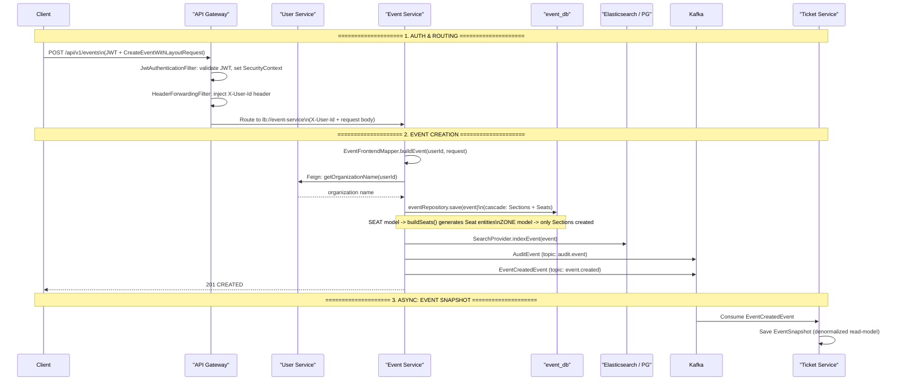

# Event Creation — Full Request Flow

**Actors:** Client → API Gateway (auth) → Event Service (creation + indexing + events)

---

## Sequence Diagram



---

## Detailed Step Breakdown

### Step 1 — Gateway Authentication & Routing

| # | Action | File | Line(s) |
|---|--------|------|---------|
| 1a | JWT token extracted, validated, SecurityContext set | `JwtAuthenticationFilter.java` | 37-65 |
| 1b | `X-User-Id` header injected from authenticated principal | `HeaderForwardingFilter.java` | 23-38 |
| 1c | Route matched: `/api/v1/event/**` → `lb://event-service` | `RoutesConfig.java` | 52-56 |

### Step 2 — Event Creation

| # | Action | File | Line(s) |
|---|--------|------|---------|
| 2a | `EventFrontendMapper.buildEvent()` constructs Event + Sections + Seats from the request | `EventFrontendMapper.java` | 26-58 |
| 2b | `buildSections()` creates Section entities from `request.categories()` | `EventFrontendMapper.java` | 60-79 |
| 2c | `buildSeats()` creates Seat entities from `request.rows()` (SEAT model only) | `EventFrontendMapper.java` | 81-112 |
| 2d | Feign call to `UserServiceClient.getOrganizationName()` for denormalized org name | `UserServiceClient.java` | 12-13 |
| 2e | Cascade persist: Event → Sections → Seats via `eventRepository.save()` | `EventService.java` | 57-58 |
| 2f | Index event in search engine (Elasticsearch or Postgres) | `EventService.java` | 59 |
| 2g | Publish `AuditEvent` → Kafka `audit.event` | `EventService.java` | 60 |
| 2h | Publish `EventCreatedEvent` → Kafka `event.created` | `EventService.java` | 61 |

### Step 3 — Async Consumer (Ticket Service)

| # | Action | File | Line(s) |
|---|--------|------|---------|
| 3a | `EventSnapshotConsumer` consumes `event.created` | `EventSnapshotConsumer.java` | 27 |
| 3b | Saves denormalized `EventSnapshot` to `ticket_db.event_snapshots` | `EventSnapshotService.java` | — |

---

## Request Body Structure

The client sends a `CreateEventWithLayoutRequest` JSON body:

```json
{
  "mode": "SEAT_BASED",
  "name": "Summer Music Fest",
  "description": "...",
  "id": "uuid-of-venue-template",
  "categoryName": "Music",
  "posterUrl": "https://...",
  "startDate": "2026-08-15T18:00:00Z",
  "finishDate": "2026-08-15T23:00:00Z",
  "categories": [
    { "id": "sec-uuid-1", "name": "VIP", "color": "#FFD700", "capacity": 100, "price": 150.00 },
    { "id": "sec-uuid-2", "name": "General", "color": "#808080", "capacity": 500, "price": 50.00 }
  ],
  "rows": [
    { "id": "row-uuid-1", "label": "A", "aisle": false,
      "cells": [
        { "id": "seat-uuid-1", "type": "seat", "number": "A1", "status": "available", "categoryId": "sec-uuid-1" }
      ]
    }
  ]
}
```

---

## Key Evidence Sources

| Step | File | Line(s) |
|------|------|---------|
| JWT validation | `JwtAuthenticationFilter.java` | 37-65 |
| X-User-Id injection | `HeaderForwardingFilter.java` | 23-38 |
| Route definition | `RoutesConfig.java` | 52-56 |
| EventController.create | `EventController.java` | 39-43 |
| EventService.create | `EventService.java` | 56-62 |
| EventFrontendMapper.buildEvent | `EventFrontendMapper.java` | 26-58 |
| buildSections | `EventFrontendMapper.java` | 60-79 |
| buildSeats | `EventFrontendMapper.java` | 81-112 |
| Feign call to User Service | `UserServiceClient.java` | 12-13 |
| EventSnapshot consumer | `EventSnapshotConsumer.java` | 27 |
