# Organization Approval — Admin Flow

**Actors:** Admin → User Service (status update + Feign unlock) → API Gateway (credential unlock) → Kafka (audit events) → Audit Service (persist log)

> **Note:** The Notification Service does **not** currently consume any org-approval event — no email or in-app notification is sent to the Org Head when their organization is approved. Only audit logs capture the action.

---

## Sequence Diagram

```mermaid
sequenceDiagram
  participant Admin
  participant UserCtrl as "UserPublicController (user-service)"
  participant AuthCli as "AuthServiceClient (Feign)"
  participant PrivCtrl as "AuthPrivateController (api-gateway)"
  participant AuthSvc as "AuthService (api-gateway)"
  participant authDB as "auth-db (Postgres)"
  participant OrgSvc as "OrganizationService (user-service)"
  participant userDB as "user-db (Postgres)"
  participant Kafka
  participant AuthPub as "AuthEventPublisher"
  participant UserPub as "UserEventPublisher"
  participant AuditConsumer as "AuditEventConsumer (audit-service)"
  participant auditDB as "audit-db (Postgres)"

  Note over Admin,auditDB: ================ 1. ADMIN APPROVES ORGANIZATION ================

  Admin->>UserCtrl: POST /api/v1/user/org/{orgHeadId}/approve\nX-User-Id: adminId
  %% Source: user-service/.../controller/UserPublicController.java:35-43

  UserCtrl->>AuthCli: unlockOrg(orgHeadId)
  %% Source: user-service/.../client/AuthServiceClient.java:13-14

  AuthCli->>PrivCtrl: POST /api/v1/private/auth/unlock-org
  %% Source: api-gateway/.../controller/AuthPrivateController.java:17-21

  PrivCtrl->>AuthSvc: unlockOrg(orgHeadId)
  %% Source: api-gateway/.../controller/AuthPrivateController.java:19

  AuthSvc->>authDB: SET locked = false,\nlockedUntil = NULL
  %% Source: api-gateway/.../service/AuthService.java:272-274

  AuthSvc->>AuthPub: AuditEvent("Approve Organization Head Request")
  %% Source: api-gateway/.../service/AuthService.java:275-276 (sendAuditEventWithNoReason)

  AuthPub->>Kafka: AuditEvent (topic: audit.event)
  %% Source: api-gateway/.../event/AuthEventPublisher.java:37-41

  UserCtrl->>OrgSvc: changeStatus(orgHeadId, APPROVED, adminId)
  %% Source: user-service/.../controller/UserPublicController.java:40

  OrgSvc->>userDB: UPDATE organization SET status = 'APPROVED'
  %% Source: user-service/.../service/OrganizationService.java:35-36

  OrgSvc->>UserPub: AuditEvent("Change Organization [X] Status to APPROVED")
  %% Source: user-service/.../service/OrganizationService.java:38-41

  UserPub->>Kafka: AuditEvent (topic: audit.event)
  %% Source: user-service/.../event/UserEventPublisher.java:22-26

  UserCtrl-->>Admin: 200 OK

  Note over Admin,auditDB: ================ 2. ASYNC: AUDIT LOGGING ================

  Kafka->>AuditConsumer: AuditEvent × 2 (unlock + status change)
  %% Source: audit-service/.../consumer/AuditEventConsumer.java:20-21

  AuditConsumer->>auditDB: INSERT INTO audit_log\n(action, made_by_id, reason, made_at)
  %% Source: audit-service/.../consumer/AuditEventConsumer.java:24-26
```

---

## Step-by-Step Breakdown

### Step 1 — Approval (Synchronous)

| # | Action | File | Line(s) |
|---|--------|------|---------|
| 1a | Admin calls approve endpoint | `UserPublicController.java` | 35-43 |
| 1b | Feign: unlockOrg(orgHeadId) → API Gateway | `AuthServiceClient.java` | 13-14 |
| 1c | API Gateway private controller receives call | `AuthPrivateController.java` | 17-21 |
| 1d | AuthService.unlockOrg(): set locked=false | `AuthService.java` | 270-276 |
| 1e | Spring AuditEvent published (api-gateway side) | `AuthService.java` | 275-276 |
| 1f | Feign return to UserPublicController | — | — |
| 1g | OrganizationService.changeStatus(): set APPROVED | `OrganizationService.java` | 31-44 |
| 1h | Spring AuditEvent published (user-service side) | `OrganizationService.java` | 38-41 |
| 1i | 200 OK returned to Admin | `UserPublicController.java` | 42 |

### Step 2 — Async Audit Logging

| # | Action | File | Line(s) |
|---|--------|------|---------|
| 2a | AuthEventPublisher sends AuditEvent → Kafka | `AuthEventPublisher.java` | 37-41 |
| 2b | UserEventPublisher sends AuditEvent → Kafka | `UserEventPublisher.java` | 22-26 |
| 2c | AuditEventConsumer consumes both events | `AuditEventConsumer.java` | 20-21 |
| 2d | AuditLog row saved for each event | `AuditEventConsumer.java` | 24-26 |

---

## Org Lifecycle (Status Transitions)

| From | To | Trigger |
|------|----|---------|
| (none) | PENDING | ORG_HEAD registers with org name |
| PENDING | APPROVED | Admin approves |
| PENDING | REJECTED | Admin rejects |
| APPROVED | BANNED | Admin bans |
| APPROVED | SUSPENDED | Admin suspends |

---

## Key Evidence Sources

| Component | File | Lines |
|-----------|------|-------|
| Admin approve endpoint | `UserPublicController.java` | 35-43 |
| Feign client → API Gateway | `AuthServiceClient.java` | 10-14 |
| API Gateway private /unlock-org | `AuthPrivateController.java` | 17-21 |
| AuthService.unlockOrg | `AuthService.java` | 270-276 |
| OrganizationService.changeStatus | `OrganizationService.java` | 31-44 |
| AuditEvent → Kafka (api-gateway) | `AuthEventPublisher.java` | 37-41 |
| AuditEvent → Kafka (user-service) | `UserEventPublisher.java` | 22-26 |
| AuditEventConsumer (audit-service) | `AuditEventConsumer.java` | 20-27 |
| Topic constant AUDIT_EVENT | `TOPIC_NAMES.java` | 41 |
| OrgStatus enum | `OrgStatus.java` | 1-9 |
| Organization entity (default PENDING) | `Organization.java` | 14-36 |
| Registration sets org as PENDING | `UserService.java` | 45-49 |
| Registration locks ORG_HEAD credential | `AuthService.java` | 392-395 |
| Login blocked for locked org heads | `AuthService.java` | 320-343 |
