# Organization Approval — Admin Flow

**Actors:** Admin → User Service (status update + Feign unlock) → API Gateway (credential unlock) → Kafka (audit + org status events via outbox) → Audit Service (persist log) + Notification Service (email to Org Head)

> **Note:** Approving an organization also notifies the Org Head by email. The Notification Service consumes the `org.status.changed` event (`NotificationEventConsumer.java:57-60`) and sends `ORG_APPROVED` / `ORG_BANNED` / `ORG_REJECTED` emails (`NotificationServiceImpl.handleOrgStatusChanged`, `NotificationServiceImpl.java:235-249`).

---

## Sequence Diagram

> **Reading the diagram:** publishing arrows are async Kafka messages written via the outbox pattern; drawn service-to-service for readability.

```mermaid
sequenceDiagram
  autonumber
  actor Admin as Admin
  participant US as "User Service"
  participant GW as "API Gateway"
  participant AuditSvc as "Audit Service"
  participant NotifSvc as "Notification Service"

  rect rgb(0, 0, 0)
    Note over Admin,GW: 1. ADMIN APPROVES ORGANIZATION
    Admin->>US: POST /api/v1/user/org/{orgHeadId}/approve (X-User-Id: adminId)
    %% Source: user-service/.../controller/UserPublicController.java:35-40
    US->>GW: Feign unlockOrg(orgHeadId) → POST /api/v1/auth/unlock-org
    %% Source: user-service/.../client/AuthServiceClient.java:13-14
    %% Source: api-gateway/.../controller/AuthController.java:136-137
    GW->>GW: SET locked = false, lockedUntil = NULL
    %% Source: api-gateway/.../service/AuthService.java:286-292
    GW->>AuditSvc: AuditEvent (audit.event) — "Approve Organization Head Request"
    %% Source: api-gateway/.../service/AuthService.java:291
    US->>US: changeStatus() → organization status = APPROVED
    %% Source: user-service/.../service/OrganizationService.java:34-56
    US->>AuditSvc: AuditEvent (audit.event) — "Change Organization status to APPROVED"
    %% Source: user-service/.../service/OrganizationService.java:42-45
    US->>NotifSvc: OrganizationStatusChangedEvent (org.status.changed)
    %% Source: user-service/.../service/OrganizationService.java:47-53
    US-->>Admin: 200 OK
  end

  rect rgb(0, 0, 0)
    Note over AuditSvc,NotifSvc: 2. ASYNC: AUDIT + NOTIFICATION
    AuditSvc->>AuditSvc: INSERT audit_log ×2
    %% Source: audit-service/.../consumer/AuditEventConsumer.java:20-27
    NotifSvc->>NotifSvc: handleOrgStatusChanged() → ORG_APPROVED EmailJob
    %% Source: notification-service/.../event/NotificationEventConsumer.java:57-60
    %% Source: notification-service/.../service/impl/NotificationServiceImpl.java:235-249
  end
```

---

## Step-by-Step Breakdown

### Step 1 — Approval (Synchronous)

| # | Action | File | Line(s) |
|---|--------|------|---------|
| 1a | Admin calls approve endpoint | `UserPublicController.java` | 35-40 |
| 1b | Feign: unlockOrg(orgHeadId) → API Gateway | `AuthServiceClient.java` | 13-14 |
| 1c | API Gateway controller receives call | `AuthController.java` | 136-137 |
| 1d | AuthService.unlockOrg(): set locked=false, lockedUntil=null | `AuthService.java` | 286-292 |
| 1e | AuditEvent published via outbox (api-gateway side) | `AuthService.java` | 291 |
| 1f | Feign return to UserPublicController | — | — |
| 1g | OrganizationService.changeStatus(): set APPROVED | `OrganizationService.java` | 34-56 |
| 1h | AuditEvent published via outbox (user-service side) | `OrganizationService.java` | 42-45 |
| 1i | OrganizationStatusChangedEvent published via outbox | `OrganizationService.java` | 47-53 |
| 1j | 200 OK returned to Admin | `UserPublicController.java` | 39 |

### Step 2 — Async Audit Logging + Notification

| # | Action | File | Line(s) |
|---|--------|------|---------|
| 2a | AuditEvent → Kafka via outbox relay (api-gateway side) | `AuthService.java` | 291 |
| 2b | AuditEvent → Kafka via outbox relay (user-service side) | `OrganizationService.java` | 42-45 |
| 2c | AuditEventConsumer consumes both events | `AuditEventConsumer.java` | 20-27 |
| 2d | AuditLog row saved for each event | `AuditEventConsumer.java` | 24-26 |
| 2e | NotificationEventConsumer consumes org.status.changed | `NotificationEventConsumer.java` | 57-60 |
| 2f | EmailJob created with ORG_APPROVED template | `NotificationServiceImpl.java` | 235-249 |

---

## Org Lifecycle (Status Transitions)

| From | To | Trigger |
|------|----|---------|
| (none) | PENDING | ORG_HEAD registers with org name |
| PENDING | APPROVED | Admin approves |
| PENDING | REJECTED | Admin rejects |
| APPROVED | BANNED | Admin bans |
| APPROVED | SUSPENDED | Admin suspends |

`OrgStatus` enum values: `PENDING, APPROVED, REJECTED, SUSPENDED, BANNED` (`OrgStatus.java:3-9`).

---

## Key Evidence Sources

| Component | File | Lines |
|-----------|------|-------|
| Admin approve endpoint | `UserPublicController.java` | 35-40 |
| Feign client → API Gateway | `AuthServiceClient.java` | 10-14 |
| API Gateway /unlock-org | `AuthController.java` | 136-137 |
| AuthService.unlockOrg | `AuthService.java` | 286-292 |
| OrganizationService.changeStatus | `OrganizationService.java` | 34-56 |
| AuditEvent via outbox (api-gateway) | `AuthService.java` | 291 |
| AuditEvent + org status via outbox (user-service) | `OrganizationService.java` | 42-53 |
| AuditEventConsumer (audit-service) | `AuditEventConsumer.java` | 20-27 |
| ORG_STATUS_CHANGED consumer (notification-service) | `NotificationEventConsumer.java` | 57-60 |
| handleOrgStatusChanged | `NotificationServiceImpl.java` | 235-249 |
| Topic constant AUDIT_EVENT | `TOPIC_NAMES.java` | 46 |
| Topic constant ORG_STATUS_CHANGED | `TOPIC_NAMES.java` | 49 |
| OrgStatus enum | `OrgStatus.java` | 3-9 |
| Organization entity (default PENDING) | `Organization.java` | — |
| Registration sets org as PENDING | `UserService.java` | 42-51 |
| Registration locks ORG_HEAD credential | `AuthService.java` | 431-434 |
| Login blocked for locked org heads | `AuthService.java` | 350-382 |
