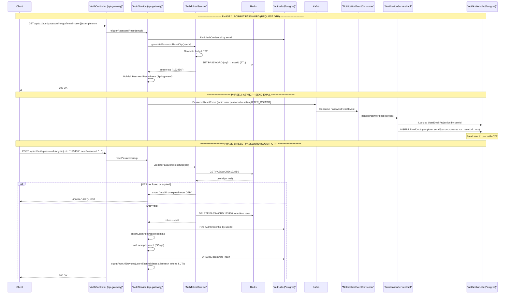

# Password Reset — OTP-Based Flow

**Actors:** Client → API Gateway (OTP generation + Redis storage) → Kafka (event) → Notification Service (email with OTP) → Client (submits OTP + new password) → API Gateway (validates, hashes, persists)

---

## Sequence Diagram

---

## Detailed Step Breakdown

### Phase 1 — Request OTP (Forgot Password)

| # | Action | File | Line(s) |
|---|--------|------|---------|
| 1a | Client calls GET `/password-forgot?email=` | `AuthController.java` | 82-86 |
| 1b | `AuthService.triggerPasswordReset()` | `AuthService.java` | 180-185 |
| 1c | `AuthTokenService.generatePasswordResetOtp()` — store in Redis | `AuthTokenService.java` | 262-267 |
| 1d | Publish `PasswordResetEvent` (Spring event) | `AuthService.java` | 184 |

### Phase 2 — Async Email Delivery

| # | Action | File | Line(s) |
|---|--------|------|---------|
| 2a | `AuthEventPublisher` sends to Kafka `user.password-reset` | `AuthEventPublisher.java` | 31-35 |
| 2b | `NotificationEventConsumer` consumes | `NotificationEventConsumer.java` | 36-39 |
| 2c | `NotificationServiceImpl.handlePasswordReset()` | `NotificationServiceImpl.java` | 88-105 |
| 2d | Creates EmailJob with template `email/password-reset` | `NotificationServiceImpl.java` | 99-104 |

### Phase 3 — Submit OTP + New Password

| # | Action | File | Line(s) |
|---|--------|------|---------|
| 3a | Client calls POST `/password-forgot` with OTP + new password | `AuthController.java` | 88-92 |
| 3b | `AuthTokenService.validatePasswordResetOtp()` — Redis lookup + delete | `AuthTokenService.java` | 275-283 |
| 3c | `assertLoginAllowed()` — checks verified, active, not locked | `AuthService.java` | 199 |
| 3d | Hash new password (BCrypt) and persist | `AuthService.java` | 200-201 |
| 3e | `logoutFromAllDevices()` — invalidate all sessions | `AuthService.java` | 202 |

---

## Redis OTP Key Structure

| Key Pattern | Value | TTL | Purpose |
|-------------|-------|-----|---------|
| `PASSWORD:{6-digit-otp}` | `userId` (UUID string) | `passwordResetExpiry` (ms) | One-time use, auto-expires |

**Evidence source:** `AuthTokenService.java:264-265`.

---

## Key Evidence Sources

| Component | File | Lines |
|-----------|------|-------|
| Forgot password endpoint (GET) | `AuthController.java` | 82-86 |
| Reset password endpoint (POST) | `AuthController.java` | 88-92 |
| Change password endpoint (PUT) | `AuthController.java` | 96-101 |
| AuthService.triggerPasswordReset | `AuthService.java` | 180-185 |
| AuthService.resetPassword | `AuthService.java` | 194-208 |
| AuthService.changePassword | `AuthService.java` | 219-230 |
| AuthTokenService.generatePasswordResetOtp | `AuthTokenService.java` | 262-267 |
| AuthTokenService.validatePasswordResetOtp | `AuthTokenService.java` | 275-283 |
| AuthEventPublisher → Kafka (password-reset) | `AuthEventPublisher.java` | 31-35 |
| Kafka topic constants | `TOPIC_NAMES.java` | 10-11 |
| Notification consumer for password-reset | `NotificationEventConsumer.java` | 36-39 |
| Notification consumer for password-change | `NotificationEventConsumer.java` | 41-44 |
| NotificationServiceImpl.handlePasswordReset | `NotificationServiceImpl.java` | 88-105 |
| NotificationServiceImpl.handlePasswordChanged | `NotificationServiceImpl.java` | 108-134 |
| PASSWORD_RESET template definition | `NotificationTemplate.java` | 18-24 |
| PASSWORD_CHANGED template definition | `NotificationTemplate.java` | 26-32 |
| Password-reset email HTML template | `password-reset.html` | 1-42 |
| Password-changed email HTML template | `password-changed.html` | 1-18 |
