# Password Reset — OTP-Based Flow

**Actors:** Client → API Gateway (OTP generation + Redis storage) → Kafka (event) → Notification Service (email with OTP) → Client (submits OTP + new password) → API Gateway (validates, hashes, persists)

---

## Sequence Diagram

> **Reading the diagram:** publishing arrows are async Kafka messages written via the outbox pattern; drawn service-to-service for readability.

```mermaid
sequenceDiagram
  autonumber
  actor Client as Client
  participant GW as "API Gateway"
  participant Redis
  participant NS as "Notification Service"

  rect rgb(0, 0, 0)
    Note over Client,NS: 1. FORGOT PASSWORD (REQUEST OTP)
    Client->>GW: GET /api/v1/auth/password-forgot?email=user@example.com
    %% Source: api-gateway/.../controller/AuthController.java:82-86
    GW->>GW: triggerPasswordReset(email) → find AuthCredential
    %% Source: api-gateway/.../service/AuthService.java:194-195
    GW->>Redis: SET auth:otp:PASSWORD:{otp} → userId (TTL)
    %% Source: api-gateway/.../service/AuthTokenService.java:262-266
    GW->>NS: PasswordResetEvent (user.password-reset)
    %% Source: api-gateway/.../service/AuthService.java:197-198
    GW-->>Client: 200 OK
  end

  rect rgb(0, 0, 0)
    Note over NS: 2. ASYNC: SEND EMAIL
    NS->>NS: Look up UserEmailProjection by userId
    %% Source: notification-service/.../service/impl/NotificationServiceImpl.java:93-94
    NS->>NS: INSERT EmailJob (template: email/password-reset, var: resetUrl = otp)
    %% Source: notification-service/.../service/impl/NotificationServiceImpl.java:102-109
  end

  rect rgb(0, 0, 0)
    Note over Client,GW: 3. RESET PASSWORD (SUBMIT OTP)
    Client->>GW: POST /api/v1/auth/password-forgot { otp, newPassword }
    %% Source: api-gateway/.../controller/AuthController.java:88-92
    GW->>Redis: GET auth:otp:PASSWORD:{otp}
    %% Source: api-gateway/.../service/AuthTokenService.java:275-283
    alt OTP invalid or expired
      GW-->>Client: 400 BAD REQUEST
    else OTP valid
      GW->>Redis: DELETE auth:otp:PASSWORD:{otp} (one-time use)
      %% Source: api-gateway/.../service/AuthTokenService.java:281
      GW->>GW: assertLoginAllowed() → hash new password (BCrypt)
      %% Source: api-gateway/.../service/AuthService.java:213-214
      GW->>GW: UPDATE password_hash
      %% Source: api-gateway/.../service/AuthService.java:214-215
      GW->>GW: logoutFromAllDevices() (invalidate all refresh tokens & JTIs)
      %% Source: api-gateway/.../service/AuthService.java:216
      GW-->>Client: 200 OK
    end
  end
```

---

## Detailed Step Breakdown

### Phase 1 — Request OTP (Forgot Password)

| # | Action | File | Line(s) |
|---|--------|------|---------|
| 1a | Client calls GET `/password-forgot?email=` | `AuthController.java` | 82-86 |
| 1b | `AuthService.triggerPasswordReset()` | `AuthService.java` | 189-195 |
| 1c | `AuthTokenService.generatePasswordResetOtp()` — store in Redis | `AuthTokenService.java` | 262-267 |
| 1d | Write `PasswordResetEvent` to outbox | `AuthService.java` | 197-198 |

### Phase 2 — Async Email Delivery

| # | Action | File | Line(s) |
|---|--------|------|---------|
| 2a | `OutboxRelay` forwards outbox row to Kafka `user.password-reset` | `OutboxRelay.java` | 32-59 |
| 2b | `NotificationEventConsumer` consumes | `NotificationEventConsumer.java` | 37-40 |
| 2c | `NotificationServiceImpl.handlePasswordReset()` | `NotificationServiceImpl.java` | 90-108 |
| 2d | Creates EmailJob with template `email/password-reset` | `NotificationServiceImpl.java` | 102-109 |

### Phase 3 — Submit OTP + New Password

| # | Action | File | Line(s) |
|---|--------|------|---------|
| 3a | Client calls POST `/password-forgot` with OTP + new password | `AuthController.java` | 88-92 |
| 3b | `AuthTokenService.validatePasswordResetOtp()` — Redis lookup + delete | `AuthTokenService.java` | 275-283 |
| 3c | `assertLoginAllowed()` — checks verified, active, not locked | `AuthService.java` | 213-214 |
| 3d | Hash new password (BCrypt) and persist | `AuthService.java` | 214-215 |
| 3e | `logoutFromAllDevices()` — invalidate all sessions | `AuthService.java` | 216 |

---

## Redis OTP Key Structure

| Key Pattern | Value | TTL | Purpose |
|-------------|-------|-----|---------|
| `auth:otp:PASSWORD:{6-digit-otp}` | `userId` (UUID string) | `passwordResetExpiry` (ms) | One-time use, auto-expires |

**Evidence source:** `AuthTokenService.java:264-265,320-322`.

---

## Key Evidence Sources

| Component | File | Lines |
|-----------|------|-------|
| Forgot password endpoint (GET) | `AuthController.java` | 82-86 |
| Reset password endpoint (POST) | `AuthController.java` | 88-92 |
| Change password endpoint (PUT) | `AuthController.java` | 96-101 |
| AuthService.triggerPasswordReset | `AuthService.java` | 189-195 |
| AuthService.resetPassword | `AuthService.java` | 204-218 |
| AuthService.changePassword | `AuthService.java` | 229-242 |
| AuthTokenService.generatePasswordResetOtp | `AuthTokenService.java` | 262-267 |
| AuthTokenService.validatePasswordResetOtp | `AuthTokenService.java` | 275-283 |
| PasswordResetEvent → outbox → Kafka | `AuthService.java` | 197-198 |
| Kafka topic constants | `TOPIC_NAMES.java` | 10-11 |
| Notification consumer for password-reset | `NotificationEventConsumer.java` | 37-40 |
| Notification consumer for password-change | `NotificationEventConsumer.java` | 42-45 |
| NotificationServiceImpl.handlePasswordReset | `NotificationServiceImpl.java` | 90-108 |
| NotificationServiceImpl.handlePasswordChanged | `NotificationServiceImpl.java` | 110-138 |
| PASSWORD_RESET template definition | `NotificationTemplate.java` | 18-24 |
| PASSWORD_CHANGED template definition | `NotificationTemplate.java` | 26-32 |
| Password-reset email template | `email/password-reset` | — |
| Password-changed email template | `email/password-changed` | — |
