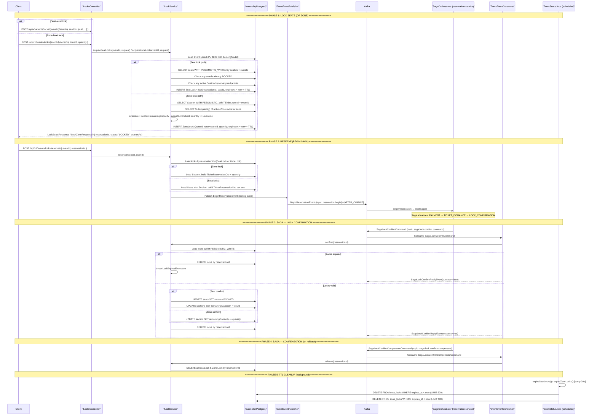

# Ticket/Seat Locking Flow

**Actors:** Client → LocksController → LockService (capacity check + lock creation with TTL) → Kafka (BeginReservationEvent) → Saga Orchestrator → Lock Confirm/Release

---

## Sequence Diagram



---

## Detailed Step Breakdown

### Phase 1 — Lock Seats/Zone

| # | Action | File | Line(s) |
|---|--------|------|---------|
| 1a | POST `/locks/{eventId}/seats` or `/zones` | `LocksController.java` | 21-35 |
| 1b | `acquireSeatLocks()` or `acquireZoneLock()` | `LockService.java` | 42 / 94 |
| 1c | Validate event is PUBLISHED + correct BookingModel | `LockService.java` | 46-51 / 98-103 |
| 1d | (Seat) Fetch seats with PESSIMISTIC_WRITE, check booked/locked | `LockService.java` | 53-78 |
| 1e | (Zone) Fetch Section with PESSIMISTIC_WRITE, sum active locks, check capacity | `LockService.java` | 105-114 |
| 1f | Create SeatLock/ZoneLock rows with `expiresAt = now + TTL` | `LockService.java` | 80-88 / 116-122 |
| 1g | Return response with `reservationId`, status `"LOCKED"`, `expiresAt` | `LockService.java` | 90 / 124 |

### Phase 2 — Reserve (Begin Saga)

| # | Action | File | Line(s) |
|---|--------|------|---------|
| 2a | POST `/locks/reserve` | `LocksController.java` | 37-41 |
| 2b | `LockService.reserve()` — load locks, build TicketReservationDto list | `LockService.java` | 231-259 |
| 2c | Publish `BeginReservationEvent` (Spring) → `EventEventPublisher` → Kafka | `LockService.java` | 245/257 |
| 2d | `EventEventPublisher` sends to Kafka topic `reservation.begin` | `EventEventPublisher.java` | 79-87 |
| 2e | `SagaReplyConsumer` consumes → starts saga | `SagaReplyConsumer.java` | 31-35 |

### Phase 3 — Saga Lock Confirmation

| # | Action | File | Line(s) |
|---|--------|------|---------|
| 3a | Saga publishes `SagaLockConfirmCommand` | `SagaOrchestrator.java` | 195-201 |
| 3b | `EventEventConsumer.lockConfirmCommandConsumer()` | `EventEventConsumer.java` | 27-37 |
| 3c | `LockService.confirm()` — load locks with PESSIMISTIC_WRITE | `LockService.java` | 128-143 |
| 3d | Check expiration; if expired, delete locks + throw | `LockService.java` | 147-151 / 182-185 |
| 3e | (Seat) Set seats BOOKED, decrement section capacity, delete locks | `LockService.java` | 145-179 |
| 3f | (Zone) Decrement section capacity, delete lock | `LockService.java` | 181-192 |
| 3g | Publish `SagaLockConfirmReplyEvent` (success/fail) | `EventEventConsumer.java` | 33-36 / `EventEventPublisher.java` 99-107 |

### Phase 4 — Saga Compensation (on rollback)

| # | Action | File | Line(s) |
|---|--------|------|---------|
| 4a | Saga publishes `SagaLockConfirmCompensateCommand` | `SagaOrchestrator.java` | 242-247 |
| 4b | `EventEventConsumer.lockConfirmCompensateConsumer()` | `EventEventConsumer.java` | 41-44 |
| 4c | `LockService.release()` — delete all locks for reservation | `LockService.java` | 195-198 |

### Phase 5 — TTL Cleanup (background)

| # | Action | File | Line(s) |
|---|--------|------|---------|
| 5a | `expireSeatLocks()` runs every 30s | `EventStatusJobs.java` | 22-29 |
| 5b | `expireZoneLocks()` runs every 30s | `EventStatusJobs.java` | 31-38 |
| 5c | Batch delete expired seat locks (max 500) | `SeatLockRepository.java` | 27-28 |
| 5d | Batch delete expired zone locks (max 500) | `ZoneLockRepository.java` | 29-30 |

---

## Lock TTL Lifecycle

```
Lock created ──► Lock is ACTIVE for TTL minutes (default: 10)
                     │
                     ├──► Client reserves → BeginReservationEvent → saga starts
                     │       │
                     │       └──► Saga confirms → seats BOOKED, lock deleted
                     │
                     ├──► Saga compensates → lock deleted (release)
                     │
                     ├──► Client releases (API) → lock deleted
                     │
                     └──► TTL expires → EventStatusJobs deletes (every 30s, batch 500)
```

**Evidence source:** `LockService.java:38` — `@Value("${app.lock.ttl:10}")` (default 10 minutes).

---

## Entity Summary

| Entity | Key Fields | Unique Constraint | Indexes |
|--------|------------|-------------------|---------|
| `SeatLock` | `seatId`, `reservationId`, `expiresAt` | `seatId` (unique) | `expires_at`, `reservation_id` |
| `ZoneLock` | `zoneId`, `reservationId`, `quantity`, `expiresAt` | — | `zone_id`, `expires_at`, `reservation_id` |

**Evidence sources:** `SeatLock.java:11-35`, `ZoneLock.java:11-39`.

---

## Key Evidence Sources

| Component | File | Lines |
|-----------|------|-------|
| Lock endpoints (seats/zones/reserve/confirm/release) | `LocksController.java` | 14-54 |
| LockService.acquireSeatLocks | `LockService.java` | 42-91 |
| LockService.acquireZoneLock | `LockService.java` | 94-125 |
| LockService.confirm | `LockService.java` | 128-143 |
| LockService.confirmSeats | `LockService.java` | 145-179 |
| LockService.confirmZone | `LockService.java` | 181-192 |
| LockService.release | `LockService.java` | 195-198 |
| LockService.reserve | `LockService.java` | 230-262 |
| Lock TTL property (`app.lock.ttl:10`) | `LockService.java` | 38 |
| SeatLock entity | `SeatLock.java` | 11-35 |
| ZoneLock entity | `ZoneLock.java` | 11-39 |
| SeatLockRepository (expiry batch delete) | `SeatLockRepository.java` | 27-28 |
| ZoneLockRepository (active quantity sum) | `ZoneLockRepository.java` | 17-18 |
| ZoneLockRepository (expiry batch delete) | `ZoneLockRepository.java` | 29-30 |
| BeginReservationEvent → Kafka | `EventEventPublisher.java` | 79-87 |
| SagaLockConfirmCommand consumer | `EventEventConsumer.java` | 27-37 |
| SagaLockConfirmCompensate consumer | `EventEventConsumer.java` | 39-44 |
| SagaLockConfirmReplyEvent → Kafka | `EventEventPublisher.java` | 99-107 |
| Saga orchestrator lock command | `SagaOrchestrator.java` | 195-201 |
| Saga orchestrator lock compensate | `SagaOrchestrator.java` | 242-247 |
| Scheduled lock cleanup jobs | `EventStatusJobs.java` | 22-38 |
| Lock-specific exceptions | `LockExceptionHandler.java` | 15-55 |
| Kafka topic constants | `TOPIC_NAMES.java` | 36-38 |
| LockSeatsRequest/Response DTOs | `LockSeatsRequest.java`, `LockSeatsResponse.java` | 8-12 |
| LockZoneRequest/Response DTOs | `LockZoneRequest.java`, `LockZoneResponse.java` | 8-12 |
