# Ticket/Seat Locking Flow

**Actors:** Client → LocksController → LockService (capacity check + lock creation with TTL) → Outbox (BeginReservationEvent) → Kafka → Saga Orchestrator → Lock Confirm/Release

---

## Sequence Diagram

> **Reading the diagram:** all event arrows are async Kafka messages written via the outbox pattern; drawn service-to-service for readability. `LocksController` + `LockService` are shown together as "Event Service".

```mermaid
sequenceDiagram
  autonumber
  actor Client as Client
  participant ES as "Event Service"
  participant RS as "Reservation Service (Saga)"
  participant Jobs as "EventStatusJobs"

  rect rgb(0, 0, 0)
    Note over Client,ES: 1. LOCK SEATS / ZONE
    alt Seat-level lock
      Client->>ES: POST /api/v1/event/locks/{eventId}/seats { seatIds }
      %% Source: event-service/.../Controller/LocksController.java:21-27
    else Zone-level lock
      Client->>ES: POST /api/v1/event/locks/{eventId}/zones { zoneId, quantity }
      %% Source: event-service/.../Controller/LocksController.java:29-35
    end
    ES->>ES: Validate PUBLISHED + bookingModel
    %% Source: event-service/.../service/LockService.java:46-54 / 98-106
    ES->>ES: Check booked / active-lock conflicts (seats) or capacity (zones)
    %% Source: event-service/.../service/LockService.java:56-81 / 108-117
    ES->>ES: INSERT SeatLock / ZoneLock (expiresAt = now + TTL, default 10 min)
    %% Source: event-service/.../service/LockService.java:82-91 / 118-125
    ES-->>Client: LockSeatsResponse / LockZoneResponse (status "LOCKED")
    %% Source: event-service/.../service/LockService.java:93 / 127
  end

  rect rgb(0, 0, 0)
    Note over Client,ES: 2. RESERVE (BEGIN SAGA)
    Client->>ES: POST /api/v1/event/locks/reserve (X-User-Id)
    %% Source: event-service/.../Controller/LocksController.java:37-41
    ES->>ES: Build TicketReservationDto list from locks
    %% Source: event-service/.../service/LockService.java:238-296
    ES->>RS: BeginReservationEvent (reservation.begin)
    %% Source: event-service/.../service/LockService.java:263,291
    RS->>RS: startSaga() → Reservation PENDING + SagaInstance ACTIVE
    %% Source: reservation-service/.../event/SagaReplyConsumer.java:31-39
  end

  rect rgb(0, 0, 0)
    Note over RS,ES: 3. SAGA LOCK CONFIRMATION
    RS->>ES: SagaLockConfirmCommand (saga.lock.confirm.command)
    %% Source: reservation-service/.../core/SagaOrchestrator.java:195-201
    alt Locks expired
      ES->>ES: Delete locks + throw LockExpiredException
      %% Source: event-service/.../service/LockService.java:150-154 / 185-190
      ES->>RS: SagaLockConfirmReplyEvent (success = false)
      %% Source: event-service/.../event/EventEventConsumer.java:36
    else Locks valid
      ES->>ES: Seats BOOKED / zone capacity decremented
      %% Source: event-service/.../service/LockService.java:156-182 / 184-199
      ES->>ES: Delete lock rows
      %% Source: event-service/.../service/LockService.java:181 / 198
      ES->>RS: SagaLockConfirmReplyEvent (success = true)
      %% Source: event-service/.../event/EventEventConsumer.java:34
    end
  end

  rect rgb(0, 0, 0)
    Note over RS,ES: 4. SAGA COMPENSATION (rollback)
    RS->>ES: SagaLockConfirmCompensateCommand (saga.lock.confirm.compensate)
    %% Source: reservation-service/.../core/SagaOrchestrator.java:237-239
    ES->>ES: release() → delete all lock rows (capacity NOT restored)
    %% Source: event-service/.../event/EventEventConsumer.java:40-45
  end

  rect rgb(0, 0, 0)
    Note over Jobs: 5. TTL CLEANUP (background)
    Jobs->>Jobs: expireSeatLocks() / expireZoneLocks() every 30s
    %% Source: event-service/.../jobs/EventStatusJobs.java:22-29 / 31-38
    Jobs->>Jobs: DELETE expired seat_locks / zone_locks (batch 500)
    %% Source: event-service/.../jobs/EventStatusJobs.java:25 / 34
  end
```



---

## Detailed Step Breakdown

### Phase 1 — Lock Seats/Zone

| # | Action | File | Line(s) |
|---|--------|------|---------|
| 1a | POST `/api/v1/event/locks/{eventId}/seats` or `/zones` | `LocksController.java` | 21-35 |
| 1b | `acquireSeatLocks()` or `acquireZoneLock()` | `LockService.java` | 45 / 97 |
| 1c | Validate event is PUBLISHED + correct BookingModel | `LockService.java` | 46-54 / 98-106 |
| 1d | (Seat) Fetch seats with lock, check booked + active-lock conflicts | `LockService.java` | 56-81 |
| 1e | (Zone) Fetch Section with lock, sum active locks, check capacity | `LockService.java` | 108-117 |
| 1f | Create SeatLock/ZoneLock rows with `expiresAt = now + TTL` (default 10 min) | `LockService.java` | 82-91 / 118-125 |
| 1g | Return response with `reservationId`, status `"LOCKED"`, `expiresAt` | `LockService.java` | 93 / 127 |

### Phase 2 — Reserve (Begin Saga)

| # | Action | File | Line(s) |
|---|--------|------|---------|
| 2a | POST `/api/v1/event/locks/reserve` with `X-User-Id` header | `LocksController.java` | 37-41 |
| 2b | `LockService.reserve()` — load locks, build TicketReservationDto list | `LockService.java` | 238-296 |
| 2c | `BeginReservationEvent` written to outbox with topic `reservation.begin` | `LockService.java` | 263 (zone) / 291 (seat) |
| 2d | `OutboxRelay` relays to Kafka (default poll 2000ms) | `OutboxRelay.java` | 32-59 |
| 2e | `SagaReplyConsumer.handleBeginReservation` consumes → starts saga | `SagaReplyConsumer.java` | 31-39 |

### Phase 3 — Saga Lock Confirmation

| # | Action | File | Line(s) |
|---|--------|------|---------|
| 3a | Saga publishes `SagaLockConfirmCommand` via outbox | `SagaOrchestrator.java` | 195-201 |
| 3b | `EventEventConsumer.lockConfirmCommandConsumer()` | `EventEventConsumer.java` | 28-38 |
| 3c | `LockService.confirm()` — load locks with lock | `LockService.java` | 131-146 |
| 3d | If expired: delete locks + throw `LockExpiredException` → failure reply | `LockService.java` | 150-154 / 185-190 |
| 3e | (Seat) Set seats BOOKED, decrement section capacity, delete locks | `LockService.java` | 156-182 |
| 3f | (Zone) Decrement section capacity, delete lock | `LockService.java` | 184-199 |
| 3g | Publish `SagaLockConfirmReplyEvent` (success/fail) via outbox | `EventEventConsumer.java` | 34 / 36 |

### Phase 4 — Saga Compensation (on rollback)

| # | Action | File | Line(s) |
|---|--------|------|---------|
| 4a | Saga publishes `SagaLockConfirmCompensateCommand` via outbox | `SagaOrchestrator.java` | 237-239 |
| 4b | `EventEventConsumer.lockConfirmCompensateConsumer()` | `EventEventConsumer.java` | 40-45 |
| 4c | `LockService.release()` — delete all locks for reservation (capacity NOT restored) | `LockService.java` | 202-206 |

### Phase 5 — TTL Cleanup (background)

| # | Action | File | Line(s) |
|---|--------|------|---------|
| 5a | `expireSeatLocks()` — `@Scheduled(fixedRate = 30_000)` | `EventStatusJobs.java` | 22-29 |
| 5b | `expireZoneLocks()` — `@Scheduled(fixedRate = 30_000)` | `EventStatusJobs.java` | 31-38 |
| 5c | Batch delete expired seat/zone locks (limit 500) | `EventStatusJobs.java` | 25 / 34 |

---

## Lock TTL Lifecycle

```
Lock created ──► Lock is ACTIVE for TTL minutes (default: 10)
                     │
                     ├──► Client reserves → BeginReservationEvent (outbox) → saga starts
                     │       │
                     │       └──► Saga confirms → seats BOOKED, capacity decremented, lock deleted
                     │
                     ├──► Saga compensates → lock deleted (release, no capacity restore)
                     │
                     ├──► Client releases (API) → lock deleted
                     │
                     └──► TTL expires → EventStatusJobs deletes (every 30s, batch 500)
```

**Evidence source:** `LockService.java:41-42` — `@Value("${app.lock.ttl:10}")` (default 10 minutes).

---

## Entity Summary

| Entity | Key Fields | Unique Constraint | Indexes |
|--------|------------|-------------------|---------|
| `SeatLock` | `seatId` (UUID), `reservationId` (String), `expiresAt`, `createdAt` | `seat_id` (unique) | `idx_seat_lock_expires`, `idx_seat_lock_reservation` |
| `ZoneLock` | `zoneId`, `reservationId` (String), `quantity`, `expiresAt`, `createdAt` | — | `idx_zone_lock_zone`, `idx_zone_lock_expires`, `idx_zone_lock_reservation` |

**Evidence sources:** `SeatLock.java:11-36`, `ZoneLock.java:11-40`.

---

## Key Evidence Sources

| Component | File | Lines |
|-----------|------|-------|
| Lock endpoints (seats/zones/reserve/confirm/release) | `LocksController.java` | 14-54 |
| LockService.acquireSeatLocks | `LockService.java` | 45-94 |
| LockService.acquireZoneLock | `LockService.java` | 97-128 |
| LockService.confirm / confirmSeats / confirmZones | `LockService.java` | 131-146 / 148-182 / 184-199 |
| LockService.release | `LockService.java` | 202-206 |
| LockService.reserve (+ BeginReservationEvent outbox) | `LockService.java` | 238-296 |
| Lock TTL property (`app.lock.ttl:10`) | `LockService.java` | 41-42 |
| SeatLock entity | `SeatLock.java` | 11-36 |
| ZoneLock entity | `ZoneLock.java` | 11-40 |
| Scheduled lock cleanup jobs | `EventStatusJobs.java` | 22-38 |
| Outbox write | `OutboxWriter.java` | 24-38 |
| Outbox relay to Kafka | `OutboxRelay.java` | 32-59 |
| BeginReservationEvent consumed | `SagaReplyConsumer.java` | 31-39 |
| Saga lock command / compensate | `SagaOrchestrator.java` | 195-201 / 237-239 |
| Lock confirm + reply consumer | `EventEventConsumer.java` | 28-38 / 40-45 |
| Lock-specific exception handling | `LockExceptionHandler.java` | 13-57 |
| Kafka topic constants | `TOPIC_NAMES.java` | 27, 37-39 |
