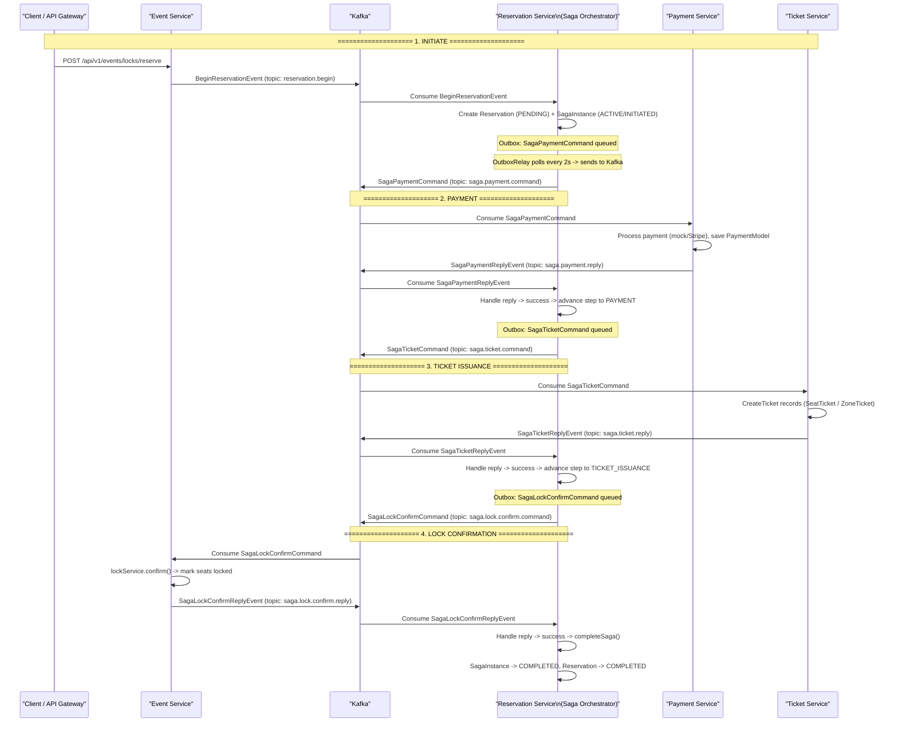

# Ticket Purchase — Saga Orchestration (Happy Path)

**Pattern:** Choreography via Kafka with centralized Saga Orchestrator (Reservation Service)  
**Key Mechanism:** Outbox Pattern — all saga commands are written to an outbox table first, then relayed to Kafka by a scheduled `OutboxRelay`.

---

## Sequence Diagram



---

## Saga Step Summary

| Step | Command Topic | Reply Topic | Service | Handler | Key Action |
|------|---------------|-------------|---------|---------|------------|
| 1. Initiate | — | — | Reservation | `SagaReplyConsumer.handleBeginReservation` | Create Reservation + SagaInstance |
| 2. Payment | `saga.payment.command` | `saga.payment.reply` | Payment | `SagaPaymentCommandConsumer` | Process payment via provider, reply success/fail |
| 3. Ticket Issuance | `saga.ticket.command` | `saga.ticket.reply` | Ticket | `SagaTicketCommandConsumer` | Create SeatTicket/ZoneTicket records |
| 4. Lock Confirm | `saga.lock.confirm.command` | `saga.lock.confirm.reply` | Event | `EventEventConsumer.lockConfirmCommandConsumer` | Mark seats as BOOKED, release locks |
| 5. Complete | — | — | Reservation | `SagaOrchestrator.completeSaga` | Mark SagaInstance + Reservation as COMPLETED |

---

## Outbox Pattern Detail

All `OutboxPublisher.publish()` calls write to the `outbox_events` table instead of sending directly to Kafka:

```
SagaOrchestrator.advanceSaga()
  -> OutboxPublisher.publish(aggregateId, topic, event)
    -> INSERT INTO outbox_events (PENDING)
      -> OutboxRelay.publishPendingEvents() [@Scheduled, every 2s]
        -> UPDATE status = IN_PROGRESS
          -> kafkaTemplate.send(topic, key, payload)
            -> on success: UPDATE status = PUBLISHED
            -> on failure: retry (up to max) or reset to PENDING
```

## Compensation Flow (Failure Path)

If any step replies with `success = false`, the orchestrator triggers `startCompensation()`:

```
SagaOrchestrator.startCompensation(saga, reason)
  -> mark SagaStatus = COMPENSATING
  -> reverse-order compensation commands via outbox:
      saga.ticket.compensate   (if tickets issued)
      saga.payment.compensate  (if payment processed)
      saga.lock.confirm.compensate  (always)
  -> mark SagaStatus = FAILED, ReservationStatus = FAILED
```

---

## Key Evidence Sources

| Step | File | Line(s) |
|------|------|---------|
| BeginReservation published | `EventEventPublisher.java` | 80-87 |
| BeginReservation consumed | `SagaReplyConsumer.java` | 31 |
| Saga started | `SagaOrchestrator.java` | 53-62 |
| Advance saga (all steps) | `SagaOrchestrator.java` | 173-209 |
| Outbox write | `OutboxPublisher.java` | 24-45 |
| Outbox relay to Kafka | `OutboxRelay.java` | 31-63 |
| Payment command consumed | `SagaPaymentCommandConsumer.java` | 33-34 |
| Payment reply sent | `SagaPaymentCommandConsumer.java` | 96-99 |
| Payment reply handled | `SagaOrchestrator.java` | 91-117 |
| Ticket command consumed | `SagaTicketCommandConsumer.java` | 26-27 |
| Ticket reply sent | `SagaTicketCommandConsumer.java` | 49-52 |
| Ticket reply handled | `SagaOrchestrator.java` | 119-144 |
| Lock confirm consumed | `EventEventConsumer.java` | 27-29 |
| Lock confirm reply sent | `EventEventPublisher.java` | 99-107 |
| Lock confirm reply handled | `SagaOrchestrator.java` | 146-171 |
| Saga completed | `SagaOrchestrator.java` | 295-310 |
