# Ticket Purchase — Saga Orchestration (Happy Path)

**Pattern:** Orchestrated saga via Kafka with centralized Saga Orchestrator (Reservation Service)
**Key Mechanism:** Outbox Pattern — all saga commands/replies are written to the `ticket_souq_outbox` table first, then relayed to Kafka by the scheduled `OutboxRelay`.

---

## Sequence Diagram

> **Reading the diagram:** all event arrows are async Kafka messages written via the outbox pattern (`OutboxWriter` → `ticket_souq_outbox` → `OutboxRelay`); they are drawn service-to-service for readability. `%% Source:` annotations reference the exact producer/consumer code.

```mermaid
sequenceDiagram
  autonumber
  actor Client as Client
  participant ES as "Event Service"
  participant RS as "Reservation Service"
  participant PS as "Payment Service"
  participant TS as "Ticket Service"

  rect rgb(0, 0, 0)
    Note over Client,ES: 1. INITIATE
    Client->>ES: POST /api/v1/event/locks/reserve (X-User-Id)
    ES->>RS: BeginReservationEvent (reservation.begin)
    %% Source: event-service/.../service/LockService.java:263,291
    RS->>RS: Create Reservation (PENDING) + SagaInstance (ACTIVE / INITIATED)
    %% Source: reservation-service/.../service/ReservationService.java:26-34
    %% Source: reservation-service/.../core/SagaOrchestrator.java:56-93
  end

  rect rgb(0, 0, 0)
    Note over RS,PS: 2. PAYMENT
    RS->>PS: SagaPaymentCommand (saga.payment.command)
    %% Source: reservation-service/.../core/SagaOrchestrator.java:180-186
    PS->>PS: PaymentProvider.pay() → PENDING / SUCCESS
    %% Source: payment-service/.../listener/SagaPaymentCommandConsumer.java:58-66
    PS->>RS: SagaPaymentReplyEvent (saga.payment.reply)
    %% Source: payment-service/.../listener/SagaPaymentCommandConsumer.java:97-100
    RS->>RS: handlePaymentReply() → step PAYMENT
    %% Source: reservation-service/.../core/SagaOrchestrator.java:95-121
  end

  rect rgb(0, 0, 0)
    Note over RS,TS: 3. TICKET ISSUANCE
    RS->>TS: SagaTicketCommand (saga.ticket.command)
    %% Source: reservation-service/.../core/SagaOrchestrator.java:190-196
    TS->>TS: createTickets() → SeatTicket / ZoneTicket
    %% Source: ticket-service/.../listener/SagaTicketCommandConsumer.java:35-41
    TS->>RS: SagaTicketReplyEvent (saga.ticket.reply)
    %% Source: ticket-service/.../listener/SagaTicketCommandConsumer.java:49-53
    RS->>RS: handleTicketReply() → step TICKET_ISSUANCE
    %% Source: reservation-service/.../core/SagaOrchestrator.java:123-148
  end

  rect rgb(0, 0, 0)
    Note over RS,ES: 4. LOCK CONFIRMATION
    RS->>ES: SagaLockConfirmCommand (saga.lock.confirm.command)
    %% Source: reservation-service/.../core/SagaOrchestrator.java:195-201
    ES->>ES: lockService.confirm() → seats BOOKED + capacity decremented
    %% Source: event-service/.../service/LockService.java:131-199
    ES->>RS: SagaLockConfirmReplyEvent (saga.lock.confirm.reply)
    %% Source: event-service/.../event/EventEventConsumer.java:34
    RS->>RS: completeSaga() → SagaInstance + Reservation COMPLETED
    %% Source: reservation-service/.../core/SagaOrchestrator.java:278-306
    RS->>RS: outbox: ReservationCompletedEvent (reservation.completed)
    %% Source: reservation-service/.../core/SagaOrchestrator.java:292-303
    %% Consumers: notification-service + analytics-service
  end
```



---

## Saga Step Summary

| Step | Command Topic | Reply Topic | Service | Handler | Key Action |
|------|---------------|-------------|---------|---------|------------|
| 1. Initiate | — | — | Event/Reservation | `LockService.reserve` → `SagaReplyConsumer.handleBeginReservation` | Acquire locks, create Reservation + SagaInstance |
| 2. Payment | `saga.payment.command` | `saga.payment.reply` | Payment | `SagaPaymentCommandConsumer` | Process payment via provider, reply success/fail |
| 3. Ticket Issuance | `saga.ticket.command` | `saga.ticket.reply` | Ticket | `SagaTicketCommandConsumer` | Create SeatTicket/ZoneTicket records |
| 4. Lock Confirm | `saga.lock.confirm.command` | `saga.lock.confirm.reply` | Event | `EventEventConsumer.lockConfirmCommandConsumer` | Confirm locks: seats BOOKED, release lock rows |
| 5. Complete | — | `reservation.completed` | Reservation | `SagaOrchestrator.completeSaga` | Mark SagaInstance + Reservation COMPLETED, publish event |

---

## Outbox Pattern Detail

Every saga command/reply goes through `OutboxWriter.save(event, topic, aggregateId)` (`ticketsouq-outbox/.../service/OutboxWriter.java:24-38`), which inserts a row into the `ticket_souq_outbox` table with `status = PENDING` inside the producer's transaction. `OutboxRelay.publishPendingEvents()` (`OutboxRelay.java:32-59`) is `@Scheduled` with `fixedDelayString = "${app.outbox.poll-interval:2000}"`:

```
OutboxWriter.save(event, topic, aggregateId)          -- transactional INSERT (PENDING)
  -> OutboxRelay.publishPendingEvents()               -- @Scheduled, every poll-interval (default 2000ms)
     -> repository.resetStuckInProgress(...)          -- recover stale IN_PROGRESS rows
     -> for each PENDING:
        -> markInProgress(eventId)                    -- claim
        -> KafkaSender.send(topic, aggregateId, payload)
           -> success: markPublished()                -- status = PUBLISHED
           -> failure: requeue()                      -- status = PENDING
           -> maxRetries reached: status = FAILED
```

A daily `cleanPublishedEvents()` cron (`OutboxRelay.java:61-66`) deletes `PUBLISHED` rows older than 7 days.

## Compensation Flow (Failure Path)

If any step replies with `success = false`, the orchestrator calls `startCompensation()` (`SagaOrchestrator.java:215-223`) then `compensate()` (`:225-263`):

```
startCompensation(saga, reason)
  -> sagaStatus = COMPENSATING
  -> compensate(): reverse-order commands via outbox (all in one transaction):
       if currentStep >= TICKET_ISSUANCE: SagaTicketCompensateCommand  (saga.ticket.compensate)
       if currentStep >= PAYMENT && paymentId != null: SagaPaymentCompensateCommand (saga.payment.compensate)
       always: SagaLockConfirmCompensateCommand  (saga.lock.confirm.compensate)
  -> sagaStatus = FAILED, ReservationStatus = FAILED
```

Compensation consumers:
- Ticket: `SagaTicketCompensateConsumer` (ticket-service) — cancels issued tickets.
- Payment: `SagaPaymentCompensateConsumer` (payment-service) — refunds the payment.
- Lock: `EventEventConsumer.lockConfirmCompensateConsumer` (`EventEventConsumer.java:40-45`) — `LockService.release()` deletes remaining lock rows.

---

## Key Evidence Sources

| Step | File | Line(s) |
|------|------|---------|
| Reserve endpoint | `LocksController.java` | 37-41 |
| BeginReservation outbox | `LockService.java` | 263, 291 |
| Outbox write | `OutboxWriter.java` | 23-42 |
| Outbox relay to Kafka | `OutboxRelay.java` | 32-59 |
| BeginReservation consumed | `SagaReplyConsumer.java` | 31-39 |
| Reservation created | `ReservationService.java` | 26-34 |
| Saga created (ACTIVE/INITIATED) | `SagaOrchestrator.java` | 56-93 |
| advanceSaga (commands via outbox) | `SagaOrchestrator.java` | 177-213 |
| Payment command consumed | `SagaPaymentCommandConsumer.java` | 34-36 |
| Payment reply sent | `SagaPaymentCommandConsumer.java` | 97-100 |
| Payment reply handled | `SagaReplyConsumer.java` 41-50 / `SagaOrchestrator.java` 95-121 |
| Ticket command consumed | `SagaTicketCommandConsumer.java` | 26-27 |
| Ticket reply sent | `SagaTicketCommandConsumer.java` | 49-53 |
| Ticket reply handled | `SagaReplyConsumer.java` 52-61 / `SagaOrchestrator.java` 123-148 |
| Lock confirm consumed | `EventEventConsumer.java` | 28-38 |
| Lock confirm handled | `SagaReplyConsumer.java` 63-72 / `SagaOrchestrator.java` 150-175 |
| Saga + reservation completed | `SagaOrchestrator.java` | 278-306 |
| Compensation orchestration | `SagaOrchestrator.java` | 215-263 |
| Saga topic constants | `TOPIC_NAMES.java` | 27-39 |
