# Ticket Refund — Saga Compensation Flow

**Actors:** Saga Orchestrator (reservation-service) → Kafka (compensate commands) → Ticket Service + Payment Service + Event Service (parallel compensation) → Stripe (webhook) → Notification Service

> **Note:** The primary refund mechanism in the codebase is **Saga Compensation**, triggered automatically when any saga step fails. There is a **gap**: saga-initiated refunds do NOT publish `RefundCompletedEvent` to Kafka, so the Notification Service is not notified. The Stripe webhook path (shown separately) only fires for externally-initiated refunds (Stripe Dashboard) and does produce notifications.

---

## Sequence Diagram

```mermaid
sequenceDiagram
  participant SO as "SagaOrchestrator (reservation-service)"
  participant Outbox as "OutboxRelay"
  participant Kafka
  participant TicketComp as "SagaTicketCompensateConsumer"
  participant TicketSvc as "TicketService"
  participant ticketDB as "ticket-db (Postgres)"
  participant PayComp as "SagaPaymentCompensateConsumer"
  participant PayProv as "PaymentProvider (Stripe)"
  participant Stripe as "Stripe API"
  participant payDB as "payment-db (Postgres)"
  participant LockComp as "EventEventConsumer"
  participant LockSvc as "LockService"
  participant Webhook as "StripeWebhookController"
  participant PaySvc as "PaymentService"
  participant PayListener as "PaymentEventListener"
  participant NotifConsumer as "NotificationEventConsumer"
  participant NotifSvc as "NotificationServiceImpl"
  participant notifDB as "notification-db (Postgres)"

  Note over SO,notifDB: ================ PHASE 1: COMPENSATION TRIGGERED ================

  SO->>SO: startCompensation(saga, reason)
  %% Source: reservation-service/.../core/SagaOrchestrator.java:211-218

  SO->>SO: compensate(saga) — check SagaStep ordinal
  %% Source: reservation-service/.../core/SagaOrchestrator.java:220-268

  SO->>Outbox: OutboxCommand × 3 (in single tx)\n1. SagaTicketCompensateCommand\n2. SagaPaymentCompensateCommand\n3. SagaLockConfirmCompensateCommand
  %% Source: reservation-service/.../core/SagaOrchestrator.java:225-247

  Outbox->>Kafka: saga.ticket.compensate
  %% Source: reservation-service/.../event/OutboxRelay.java:31-63

  Outbox->>Kafka: saga.payment.compensate
  Outbox->>Kafka: saga.lock.confirm.compensate

  Note over SO,notifDB: ================ PHASE 2: TICKET CANCELLATION ================

  Kafka->>TicketComp: SagaTicketCompensateCommand(reservationId)
  %% Source: ticket-service/.../listener/SagaTicketCompensateConsumer.java:21-22

  TicketComp->>TicketSvc: cancelByReservation(request)
  %% Source: ticket-service/.../listener/SagaTicketCompensateConsumer.java:26

  TicketSvc->>ticketDB: SET reservation_status = 'CANCELLED'\nWHERE reservation_id = ?
  %% Source: ticket-service/.../service/TicketService.java:98-106

  Note over SO,notifDB: ================ PHASE 3: PAYMENT REFUND ================

  Kafka->>PayComp: SagaPaymentCompensateCommand(reservationId, paymentId)
  %% Source: payment-service/.../listener/SagaPaymentCompensateConsumer.java:25-27

  PayComp->>PayProv: refund(paymentId)
  %% Source: payment-service/.../listener/SagaPaymentCompensateConsumer.java:43

  PayProv->>Stripe: Refund.create(paymentIntentId)
  %% Source: payment-service/.../paymentProviders/StripePaymentProvider.java:91-95

  Stripe-->>PayProv: Refund success
  PayProv->>payDB: SET payment_status = 'REFUNDED'
  %% Source: payment-service/.../paymentProviders/StripePaymentProvider.java:97-98

  Note over PayProv: ⚠️ No RefundCompletedEvent published here.\nNotification gap — user is NOT notified.

  Note over SO,notifDB: ================ PHASE 4: LOCK RELEASE ================

  Kafka->>LockComp: SagaLockConfirmCompensateCommand(reservationId)
  %% Source: event-service/.../event/EventEventConsumer.java:39-41

  LockComp->>LockSvc: release(reservationId)
  %% Source: event-service/.../event/EventEventConsumer.java:43

  Note over SO,notifDB: ================ PHASE 5: STRIPE WEBHOOK (separate path) ================

  Note over Stripe,Webhook: Stripe sends charge.refunded webhook\n(only for externally-initiated refunds)

  Stripe->>Webhook: POST /api/v1/webhook/stripe\ncharge.refunded
  %% Source: payment-service/.../controller/StripeWebhookController.java:30-47

  Webhook->>PaySvc: handleWebhookEvent(event)
  %% Source: payment-service/.../service/PaymentService.java:57-63

  PaySvc->>payDB: Check payment_status

  alt Already REFUNDED (saga path)
    PaySvc->>PaySvc: SKIP — duplicate
    %% Source: payment-service/.../service/PaymentService.java:124-126
  else Not REFUNDED (external refund)
    PaySvc->>payDB: SET payment_status = 'REFUNDED'
    PaySvc->>PaySvc: Publish RefundCompletedEvent
    %% Source: payment-service/.../service/PaymentService.java:130-136

    PayListener->>Kafka: RefundCompletedEvent (topic: payment.refunded)
    %% Source: payment-service/.../listener/PaymentEventListener.java:36-40

    Kafka->>NotifConsumer: Consume RefundCompletedEvent
    %% Source: notification-service/.../event/NotificationEventConsumer.java:24-27

    NotifConsumer->>NotifSvc: handleRefundCompleted(event)
    %% Source: notification-service/.../event/NotificationEventConsumer.java:26

    NotifSvc->>notifDB: INSERT in-app Notification (EVENT_CANCELLED type)
    %% Source: notification-service/.../service/impl/NotificationServiceImpl.java:205-211

    NotifSvc->>notifDB: INSERT EmailJob (template: email/refund-completed)
    %% Source: notification-service/.../service/impl/NotificationServiceImpl.java:219-224
  end
```

---

## Parallel Compensation Chart

| Command | Kafka Topic | Consumer | Service | Action |
|---------|-------------|----------|---------|--------|
| `SagaTicketCompensateCommand` | `saga.ticket.compensate` | `SagaTicketCompensateConsumer` | Ticket | Sets `reservation_status = CANCELLED` on all reservation tickets |
| `SagaPaymentCompensateCommand` | `saga.payment.compensate` | `SagaPaymentCompensateConsumer` | Payment | Calls `StripePaymentProvider.refund()` → Stripe API → marks `REFUNDED` |
| `SagaLockConfirmCompensateCommand` | `saga.lock.confirm.compensate` | `EventEventConsumer` | Event | Calls `LockService.release()` to free seat/zone locks |

---

## Detailed Step Breakdown

### Phase 1 — Compensation Triggered

| # | Action | File | Line(s) |
|---|--------|------|---------|
| 1a | `startCompensation()` sets saga to COMPENSATING | `SagaOrchestrator.java` | 211-218 |
| 1b | `compensate()` builds commands based on `SagaStep` ordinal | `SagaOrchestrator.java` | 220-268 |
| 1c | Commands saved to Outbox in single transaction | `SagaOrchestrator.java` | 250-254 |
| 1d | OutboxRelay polls every 2s → sends to Kafka | `OutboxRelay.java` | 31-63 |

### Phase 2 — Ticket Cancellation

| # | Action | File | Line(s) |
|---|--------|------|---------|
| 2a | Consume `SagaTicketCompensateCommand` | `SagaTicketCompensateConsumer.java` | 21-22 |
| 2b | `cancelByReservation()` → CANCELLED | `TicketService.java` | 98-106 |

### Phase 3 — Payment Refund

| # | Action | File | Line(s) |
|---|--------|------|---------|
| 3a | Consume `SagaPaymentCompensateCommand` | `SagaPaymentCompensateConsumer.java` | 25-27 |
| 3b | `StripePaymentProvider.refund()` → `Refund.create()` | `StripePaymentProvider.java` | 82-102 |
| 3c | Payment marked REFUNDED (no event published) | `SagaPaymentCompensateConsumer.java` | 43-45 |

### Phase 4 — Lock Release

| # | Action | File | Line(s) |
|---|--------|------|---------|
| 4a | Consume `SagaLockConfirmCompensateCommand` | `EventEventConsumer.java` | 39-41 |
| 4b | `LockService.release(reservationId)` | `EventEventConsumer.java` | 43 |

### Phase 5 — Stripe Webhook (external refunds only)

| # | Action | File | Line(s) |
|---|--------|------|---------|
| 5a | Stripe sends `charge.refunded` webhook | `StripeWebhookController.java` | 30-47 |
| 5b | `handleRefundCompleted()` — skips if already REFUNDED | `PaymentService.java` | 119-139 |
| 5c | `PaymentEventListener` → Kafka `payment.refunded` | `PaymentEventListener.java` | 36-40 |
| 5d | `NotificationServiceImpl.handleRefundCompleted()` | `NotificationServiceImpl.java` | 196-226 |
| 5e | Creates in-app Notification + EmailJob | `NotificationServiceImpl.java` | 205-224 |

---

## Gap Analysis

| Gap | Impact | Root Cause |
|-----|--------|------------|
| Saga-triggered refunds do **not** send notifications | Org Head never receives "your tickets have been refunded" email | `SagaPaymentCompensateConsumer` marks payment REFUNDED directly without publishing a `RefundCompletedEvent` to Kafka |
| Stripe webhook is a no-op for saga refunds | Notification remains unsent even though webhook arrives | `handleRefundCompleted()` checks `REFUNDED` status and returns early |
| `TicketCancelledEvent` defined but never published/consumed | Dead code — no event-driven ticket cancellation exists outside saga | No publisher nor consumer wired |

---

## Key Evidence Sources

| Component | File | Lines |
|-----------|------|-------|
| Saga compensation entry point | `SagaOrchestrator.java` | 211-218 |
| Compensate command builder | `SagaOrchestrator.java` | 220-268 |
| Outbox publish | `SagaOrchestrator.java` | 250-254 |
| OutboxRelay scheduled sender | `OutboxRelay.java` | 31-63 |
| Ticket compensate consumer | `SagaTicketCompensateConsumer.java` | 21-31 |
| TicketService.cancelByReservation | `TicketService.java` | 98-106 |
| Payment compensate consumer | `SagaPaymentCompensateConsumer.java` | 25-51 |
| StripePaymentProvider.refund | `StripePaymentProvider.java` | 82-102 |
| Lock compensate consumer | `EventEventConsumer.java` | 39-44 |
| Stripe webhook endpoint | `StripeWebhookController.java` | 30-47 |
| PaymentService.handleRefundCompleted | `PaymentService.java` | 119-139 |
| PaymentEventListener → Kafka | `PaymentEventListener.java` | 36-40 |
| Notification consumer for refund | `NotificationEventConsumer.java` | 24-27 |
| NotificationServiceImpl.handleRefundCompleted | `NotificationServiceImpl.java` | 196-226 |
| Kafka topic names | `TOPIC_NAMES.java` | 24, 30, 34, 37 |
| SagaStep enum | `SagaStep.java` | 3-9 |
