# Ticket Refund — Saga Compensation Flow

**Actors:** Saga Orchestrator (reservation-service) → Kafka (compensate commands) → Ticket Service + Payment Service + Event Service (parallel compensation) → Stripe (refund API)

> **Note:** The primary refund mechanism in the codebase is **Saga Compensation**, triggered automatically when any saga step fails. Saga-triggered refunds mark the payment `REFUNDED` directly **without** publishing a `RefundCompletedEvent`, so the Notification Service is not notified. The `RefundCompletedEvent` → `payment.refunded` → notification path exists (`PaymentService.handleRefundCompleted`) and is reachable through the Stripe webhook (`POST /api/v1/payment/webhook/stripe`).

---

## Sequence Diagram

> **Reading the diagram:** all compensate commands are async Kafka messages written via the outbox pattern; drawn service-to-service for readability.

```mermaid
sequenceDiagram
  autonumber
  participant SO as "Saga Orchestrator (reservation-service)"
  participant TS as "Ticket Service"
  participant PS as "Payment Service"
  participant ES as "Event Service"

  rect rgb(0, 0, 0)
    Note over SO: 1. COMPENSATION TRIGGERED
    SO->>SO: startCompensation(saga, reason) → sagaStatus = COMPENSATING
    %% Source: reservation-service/.../core/SagaOrchestrator.java:215-223
    SO->>SO: compensate() per SagaStep ordinal — all commands in one transaction
    %% Source: reservation-service/.../core/SagaOrchestrator.java:225-263
    SO->>SO: sagaStatus = FAILED, ReservationStatus = FAILED
    %% Source: reservation-service/.../core/SagaOrchestrator.java:246-260
  end

  rect rgb(0, 0, 0)
    Note over TS: 2. TICKET CANCELLATION
    SO->>TS: SagaTicketCompensateCommand (saga.ticket.compensate)
    %% Source: reservation-service/.../core/SagaOrchestrator.java:230-234
    TS->>TS: cancelByReservation() → reservation_status = CANCELLED
    %% Source: ticket-service/.../service/TicketService.java:104-114
  end

  rect rgb(0, 0, 0)
    Note over PS: 3. PAYMENT REFUND
    SO->>PS: SagaPaymentCompensateCommand (saga.payment.compensate)
    %% Source: reservation-service/.../core/SagaOrchestrator.java:236-240
    PS->>PS: refund() only if status SUCCESS → payment REFUNDED
    %% Source: payment-service/.../listener/SagaPaymentCompensateConsumer.java:42-46
    Note over PS: ⚠️ No RefundCompletedEvent published → notification gap
    %% Source: payment-service/.../listener/SagaPaymentCompensateConsumer.java:42-46
  end

  rect rgb(0, 0, 0)
    Note over ES: 4. LOCK RELEASE
    SO->>ES: SagaLockConfirmCompensateCommand (saga.lock.confirm.compensate)
    %% Source: reservation-service/.../core/SagaOrchestrator.java:237-239
    ES->>ES: release() → delete lock rows (capacity NOT restored)
    %% Source: event-service/.../event/EventEventConsumer.java:40-45
  end
```

---

## Parallel Compensation Chart

| Command | Kafka Topic | Consumer | Service | Action |
|---------|-------------|----------|---------|--------|
| `SagaTicketCompensateCommand` | `saga.ticket.compensate` | `SagaTicketCompensateConsumer` | Ticket | Sets `reservation_status = CANCELLED` on all reservation tickets |
| `SagaPaymentCompensateCommand` | `saga.payment.compensate` | `SagaPaymentCompensateConsumer` | Payment | Calls `StripePaymentProvider.refund()` → Stripe API → marks `REFUNDED` (no event) |
| `SagaLockConfirmCompensateCommand` | `saga.lock.confirm.compensate` | `EventEventConsumer` | Event | Calls `LockService.release()` to free seat/zone locks |

---

## Detailed Step Breakdown

### Phase 1 — Compensation Triggered

| # | Action | File | Line(s) |
|---|--------|------|---------|
| 1a | `startCompensation()` sets saga to COMPENSATING, saves fail reason | `SagaOrchestrator.java` | 215-223 |
| 1b | `compensate()` publishes reverse-order commands based on `SagaStep` ordinal | `SagaOrchestrator.java` | 225-263 |
| 1c | Ticket compensate published if step >= TICKET_ISSUANCE | `SagaOrchestrator.java` | 230-234 |
| 1d | Payment compensate published if step >= PAYMENT and `paymentId != null` | `SagaOrchestrator.java` | 236-240 |
| 1e | Lock compensate always published | `SagaOrchestrator.java` | 237-239 |
| 1f | Saga marked FAILED, Reservation marked FAILED | `SagaOrchestrator.java` | 246-260 |
| 1g | OutboxRelay polls (default 2000ms) → sends to Kafka | `OutboxRelay.java` | 32-59 |

### Phase 2 — Ticket Cancellation

| # | Action | File | Line(s) |
|---|--------|------|---------|
| 2a | Consume `SagaTicketCompensateCommand` | `SagaTicketCompensateConsumer.java` | 21-22 |
| 2b | `cancelByReservation(CancelTicketRequest)` → sets `reservation_status = CANCELLED` | `TicketService.java` | 104-114 |

### Phase 3 — Payment Refund

| # | Action | File | Line(s) |
|---|--------|------|---------|
| 3a | Consume `SagaPaymentCompensateCommand` | `SagaPaymentCompensateConsumer.java` | 25-27 |
| 3b | `paymentProvider.refund()` called only if payment status is SUCCESS | `SagaPaymentCompensateConsumer.java` | 42-46 |
| 3c | `StripePaymentProvider.refund()` → `Refund.create()` → marks REFUNDED | `StripePaymentProvider.java` | 80-102 |
| 3d | No outbox event published — **notification gap** | `SagaPaymentCompensateConsumer.java` | 42-46 |

### Phase 4 — Lock Release

| # | Action | File | Line(s) |
|---|--------|------|---------|
| 4a | Consume `SagaLockConfirmCompensateCommand` | `EventEventConsumer.java` | 40-42 |
| 4b | `LockService.release(reservationId)` deletes remaining lock rows | `EventEventConsumer.java` | 44 |

### Phase 5 — Stripe Webhook (refund notification path)

| # | Action | File | Line(s) |
|---|--------|------|---------|
| 5a | `StripeWebhookController` enabled — `@RestController` at `POST /api/v1/payment/webhook/stripe` | `StripeWebhookController.java` | 16-19 |
| 5b | `handleWebhookEvent()` routes `charge.refunded` → `handleRefundCompleted()` | `PaymentService.java` | 41-71 |
| 5c | `handleRefundCompleted()` skips if already REFUNDED | `PaymentService.java` | 134-137 |
| 5d | Marks REFUNDED, publishes `RefundCompletedEvent` via OutboxWriter → `payment.refunded` | `PaymentService.java` | 138-147 |
| 5e | Notification consumer `RefundCompletedConsumer` → `handleRefundCompleted` | `NotificationEventConsumer.java` | 25-28 |
| 5f | Creates in-app notification + EmailJob (template `email/refund-completed`, type EVENT_CANCELLED) | `NotificationServiceImpl.java` | 200-233 |

---

## Gap Analysis

| Gap | Impact | Root Cause |
|-----|--------|------------|
| Saga-triggered refunds do **not** send notifications | User never receives "your payment has been refunded" email | `SagaPaymentCompensateConsumer` marks payment REFUNDED directly (`:42-46`) without publishing a `RefundCompletedEvent` to Kafka |
| Refund notifications only fire via the Stripe webhook | The `payment.refunded` path is only exercised when Stripe sends `charge.refunded` | `handleRefundCompleted` is webhook-driven (`PaymentService.java:129-150`) |
| `RefundCompletedEvent` field mislabeling | Notification looks up `userId`/`eventId` from customer/reservation IDs | `PaymentService.java:141-146` passes `customerID`/`reservationID` into the `userId`/`eventId` slots |
| `TicketCancelledEvent` defined but never published/consumed | Dead code — no event-driven ticket cancellation outside saga | Only definition in `shared-module/.../events/TicketCancelledEvent.java`; no publisher nor consumer |

---

## Key Evidence Sources

| Component | File | Lines |
|-----------|------|-------|
| Saga compensation entry point | `SagaOrchestrator.java` | 215-223 |
| Compensate command builder | `SagaOrchestrator.java` | 225-263 |
| OutboxRelay scheduled sender | `OutboxRelay.java` | 32-59 |
| Ticket compensate consumer | `SagaTicketCompensateConsumer.java` | 21-31 |
| TicketService.cancelByReservation | `TicketService.java` | 104-114 |
| Payment compensate consumer (no event) | `SagaPaymentCompensateConsumer.java` | 25-51 |
| StripePaymentProvider.refund | `StripePaymentProvider.java` | 80-102 |
| Lock compensate consumer | `EventEventConsumer.java` | 40-45 |
| Stripe webhook controller | `StripeWebhookController.java` | 16-19 |
| PaymentService.handleRefundCompleted | `PaymentService.java` | 129-150 |
| RefundCompletedEvent record | `RefundCompletedEvent.java` | 6-11 |
| Notification consumer for refund | `NotificationEventConsumer.java` | 25-28 |
| NotificationServiceImpl.handleRefundCompleted | `NotificationServiceImpl.java` | 200-233 |
| EVENT_CANCELLED template | `NotificationTemplate.java` | 42-48 |
| Kafka topic names | `TOPIC_NAMES.java` | 24, 31, 35, 38 |
| SagaStep enum | `SagaStep.java` | — |
