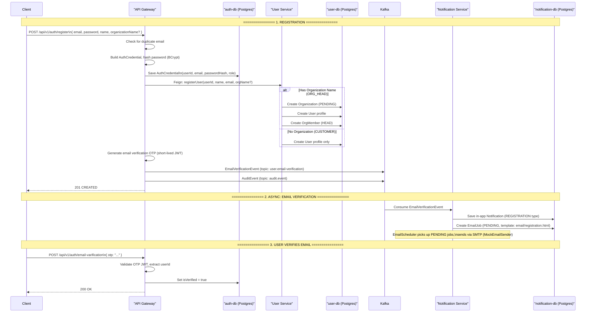

# User Registration & Email Verification — Full Request Flow

**Actors:** Client → API Gateway (AuthCredential + password hashing) → User Service (profile + org) → Notification Service (email job)

---

## Sequence Diagram

---

## Detailed Step Breakdown

### Step 1 — Registration

| # | Action | File | Line(s) |
|---|--------|------|---------|
| 1a | Duplicate email check | `AuthService.java` | 63 |
| 1b | Hash password (BCrypt), build AuthCredential | `AuthService.java` | 64, 382-398 |
| 1c | Persist AuthCredential to auth-db | `AuthService.java` | 65 |
| 1d | Feign call: registerUser → User Service | `UserServiceClient.java` | 13-14 |
| 1e | (If org) Create Organization + User + OrgMember | `UserService.java` | 45-63 |
| 1f | (If no org) Create User profile only | `UserService.java` | 70-76 |
| 1g | Generate email verification OTP | `AuthService.java` | 400-407 |
| 1h | Publish EmailVerificationEvent → Kafka | `AuthEventPublisher.java` | 25-29 |
| 1i | Publish AuditEvent → Kafka | `AuthService.java` | 68 |

### Step 2 — Async Email Processing

| # | Action | File | Line(s) |
|---|--------|------|---------|
| 2a | Consume EmailVerificationEvent | `NotificationEventConsumer.java` | 46-48 |
| 2b | Save in-app Notification + EmailJob | `NotificationServiceImpl.java` | — |

### Step 3 — Email Verification

| # | Action | File | Line(s) |
|---|--------|------|---------|
| 3a | Validate OTP JWT, extract userId | `AuthService.java` | 165-166 |
| 3b | Update AuthCredential: isVerified = true | `AuthService.java` | 167-169 |

---

## AuthCredential (auth-db) Schema

| Column | Type | Description |
|--------|------|-------------|
| user_id | UUID PK | Auto-generated, shared with User Service |
| email | VARCHAR UNIQUE | Login identifier |
| password_hash | VARCHAR | BCrypt hash |
| role | ENUM | CUSTOMER, ORG_HEAD, AGENT |
| is_active | BOOLEAN | Account active flag |
| is_verified | BOOLEAN | Email verified flag |
| failed_attempts | INT | Login failure counter |
| is_locked | BOOLEAN | Account lock flag |
| locked_until | TIMESTAMP | Lock expiration |

---

## Key Evidence Sources

| Step | File | Line(s) |
|------|------|---------|
| Register endpoint | `AuthController.java` | 30-34 |
| AuthService.register | `AuthService.java` | 62-69 |
| buildCredential | `AuthService.java` | 382-398 |
| sendVarificationNotification | `AuthService.java` | 400-407 |
| UserServiceClient Feign | `UserServiceClient.java` | 13-14 |
| UserService.register (org path) | `UserService.java` | 38-66 |
| UserService.register (customer path) | `UserService.java` | 69-77 |
| AuthEventPublisher → Kafka | `AuthEventPublisher.java` | 25-29 |
| EmailVerificationEvent consumed | `NotificationEventConsumer.java` | 46-48 |
| Verify email endpoint | `AuthService.java` | 164-170 |
