# User Registration & Email Verification — Full Request Flow

**Actors:** Client → API Gateway (AuthCredential + password hashing) → User Service (profile + org) → Notification Service (email job)

---

## Sequence Diagram

> **Reading the diagram:** publishing arrows are async Kafka messages written via the outbox pattern; drawn service-to-service for readability.

```mermaid
sequenceDiagram
  autonumber
  actor Client as Client
  participant GW as "API Gateway"
  participant US as "User Service"
  participant NS as "Notification Service"

  rect rgb(0, 0, 0)
    Note over Client,NS: 1. REGISTRATION
    Client->>GW: POST /api/v1/auth/register { email, password, name, organizationName? }
    GW->>GW: Check duplicate email → build AuthCredential, hash password (BCrypt)
    %% Source: api-gateway/.../service/AuthService.java:76 / 421-437
    GW->>US: Feign registerUser(userId, name, email, orgName?)
    %% Source: api-gateway/.../client/UserServiceClient.java:15-16
    alt Has organization name (ORG_HEAD)
      US->>US: Create Organization (PENDING) + profile + OrgMember (HEAD)
      %% Source: user-service/.../service/UserService.java:47-65
    else No organization (CUSTOMER)
      US->>US: Create profile only
      %% Source: user-service/.../service/UserService.java:72-77
    end
    GW->>GW: Generate 6-digit email verification OTP (Redis key auth:otp:EMAIL:{otp})
    %% Source: api-gateway/.../service/AuthService.java:439-446
    GW->>NS: EmailVerificationEvent (user.email-verification)
    %% Source: api-gateway/.../service/AuthService.java:440-445
    GW->>NS: AuditEvent (audit.event)
    %% Source: api-gateway/.../service/AuthService.java:81 / 452-454
    GW-->>Client: 201 CREATED
  end

  rect rgb(0, 0, 0)
    Note over NS: 2. ASYNC: EMAIL VERIFICATION
    NS->>NS: Save UserEmailProjection (if missing) + create EmailJob
    %% Source: notification-service/.../event/NotificationEventConsumer.java:47-50
    Note over NS: EmailScheduler sends via SMTP (MockEmailSender) with OTP
  end

  rect rgb(0, 0, 0)
    Note over Client,GW: 3. USER VERIFIES EMAIL
    Client->>GW: POST /api/v1/auth/email-varification { otp }
    GW->>GW: Validate OTP against Redis (one-time use) → extract userId
    %% Source: api-gateway/.../service/AuthService.java:179
    GW->>GW: Set isVerified = true
    %% Source: api-gateway/.../service/AuthService.java:181
    GW-->>Client: 200 OK
  end
```

---

## Detailed Step Breakdown

### Step 1 — Registration

| # | Action | File | Line(s) |
|---|--------|------|---------|
| 1a | Duplicate email check | `AuthService.java` | 76 |
| 1b | Hash password (BCrypt), build AuthCredential | `AuthService.java` | 421-437 |
| 1c | Persist AuthCredential to auth-db | `AuthService.java` | 74 |
| 1d | Feign call: registerUser → User Service | `UserServiceClient.java` | 15-16 |
| 1e | (If org) Create Organization + User + OrgMember | `UserService.java` | 47-65 |
| 1f | (If no org) Create User profile only | `UserService.java` | 72-77 |
| 1g | Generate email verification OTP (Redis) | `AuthService.java` | 439-446 |
| 1h | Publish EmailVerificationEvent via outbox | `AuthService.java` | 440-445 |
| 1i | Publish AuditEvent via outbox | `AuthService.java` | 81, 452-454 |

### Step 2 — Async Email Processing

| # | Action | File | Line(s) |
|---|--------|------|---------|
| 2a | Consume EmailVerificationEvent | `NotificationEventConsumer.java` | 47-50 |
| 2b | Create EmailJob (no in-app notification) | `NotificationServiceImpl.java` | 46-63 |

### Step 3 — Email Verification

| # | Action | File | Line(s) |
|---|--------|------|---------|
| 3a | Validate OTP against Redis, extract userId | `AuthService.java` | 179 |
| 3b | Update AuthCredential: isVerified = true | `AuthService.java` | 181 |

---

## AuthCredential (auth-db) Schema

| Column | Type | Description |
|--------|------|-------------|
| user_id | UUID PK | Auto-generated, shared with User Service |
| email | VARCHAR UNIQUE | Login identifier |
| password_hash | VARCHAR | BCrypt hash |
| role | ENUM | CUSTOMER, ADMIN, ORG_HEAD, ORG_Agent, ORG_Consumer |
| is_active | BOOLEAN | Account active flag |
| is_verified | BOOLEAN | Email verified flag |
| failed_attempts | INT | Login failure counter |
| is_locked | BOOLEAN | Account lock flag |
| locked_until | TIMESTAMP | Lock expiration |

---

## Key Evidence Sources

| Step | File | Line(s) |
|------|------|---------|
| Register endpoint | `AuthController.java` | 30-34 |
| AuthService.register | `AuthService.java` | 70-78 |
| buildCredential | `AuthService.java` | 421-437 |
| sendVarificationNotification | `AuthService.java` | 439-446 |
| UserServiceClient Feign | `UserServiceClient.java` | 15-16 |
| UserService.register (org path) | `UserService.java` | 40-68 |
| UserService.register (customer path) | `UserService.java` | 71-78 |
| EmailVerificationEvent → outbox → Kafka | `AuthService.java` | 440-445 |
| EmailVerificationEvent consumed | `NotificationEventConsumer.java` | 47-50 |
| Verify email endpoint | `AuthService.java` | 173-179 |
