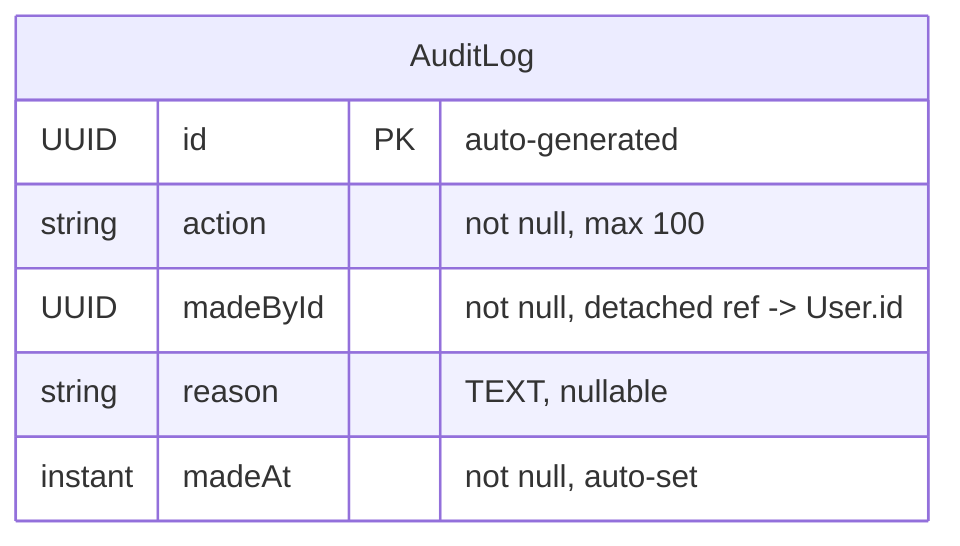

# Audit Service — Entity Relationship Diagram

**Database:** `audit_db` (PostgreSQL)  
**Entity:** AuditLog  
**Pattern:** Append-only immutable audit ledger — no updates, no deletes, no JPA relationships.

---

## ER Diagram



---

## Entity Definition

### AuditLog (table: `audit_logs`)
| Column | Type | Constraints | Description |
|--------|------|-------------|-------------|
| id | UUID | PK, auto-generated | Unique audit record ID |
| action | VARCHAR(100) | NOT NULL | Action identifier (e.g. `USER_BANNED`, `ORG_APPROVED`) |
| made_by_id | UUID | NOT NULL | Logical FK → User.id (who performed the action) |
| reason | TEXT | nullable | Free-text justification or context |
| made_at | TIMESTAMP | NOT NULL, indexed | Action timestamp, auto-set by Hibernate |

### Indexes
```sql
CREATE INDEX idx_audit_made_by ON audit_logs (madeById);
CREATE INDEX idx_audit_action ON audit_logs (action);
CREATE INDEX idx_audit_made_at ON audit_logs (madeAt);
```
All three indexes are declared via `@Index` annotations on the `@Table` definition to support the repository query methods.

---

## Key Design Details

### Append-Only Ledger
- The class has **no `@Setter`** — instances can only be constructed and persisted, never mutated
- No update or delete operations are exposed in the repository or service layer
- This enforces an **immutable audit trail** — once written, a record cannot be altered or removed

### Detached UUID Reference
`madeById` is a plain UUID pointing to `User.id` from the **user-service** or **api-gateway**. There is no JPA relationship — the audit service is fully decoupled from upstream services.

### Supported Queries (via `AuditLogRepository`)
| Method | Uses Index |
|--------|------------|
| `findByMadeByIdOrderByMadeAtDesc` | `idx_audit_made_by` |
| `findByActionOrderByMadeAtDesc` | `idx_audit_action` |
| `findByMadeAtBetweenOrderByMadeAtDesc` | `idx_audit_made_at` |
| `findByActionAndMadeByIdOrderByMadeAtDesc` | `idx_audit_made_by` + `idx_audit_action` |

### Audit Event Flow
```
Service (user/event/gateway) -> Kafka (audit.event topic)
                              -> AuditEventConsumer
                              -> AuditServiceImpl.save()
                              -> INSERT INTO audit_logs
```

### Zero JPA Relationships
`AuditLog` is a fully standalone entity with no `@ManyToOne`, `@OneToMany`, or any other relationship annotations. The single foreign-key reference (`madeById`) is a detached UUID.

---

## Relationship Summary

| Source | Target | Type | FK Field | Evidence |
|--------|--------|------|----------|----------|
| AuditLog | User (external) | Logical N:1 (UUID) | `madeById` | `AuditLog.java:31-32` |
