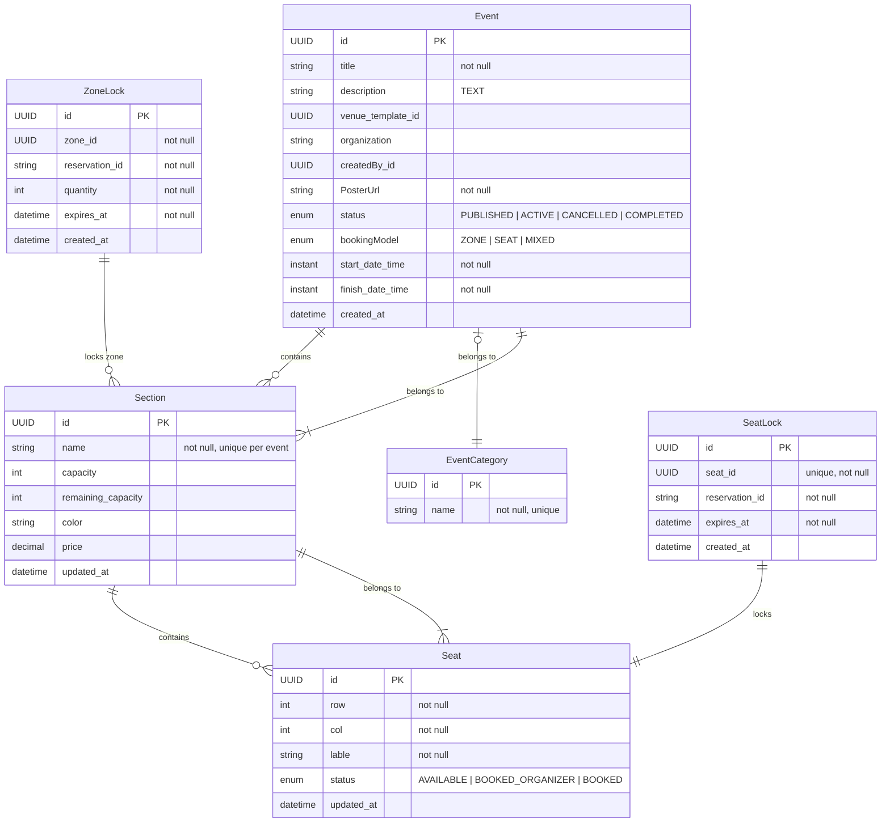

# Event Service — Entity Relationship Diagram

**Database:** `event_db` (PostgreSQL)  
**Entities:** Event, EventCategory, Section, Seat, SeatLock, ZoneLock

---

## ER Diagram

---

## Entity Definitions

### Event
| Column | Type | Constraints | Description |
|--------|------|-------------|-------------|
| id | UUID | PK, auto-generated | Unique event identifier |
| title | VARCHAR(255) | NOT NULL | Event title |
| description | TEXT | nullable | Event description |
| venue_template_id | UUID | nullable | Links to venue layout template |
| event_category_id | UUID | FK → EventCategory | Event category |
| organization | VARCHAR(255) | nullable | Organization name (denormalized) |
| createdBy_id | UUID | nullable | User who created the event |
| PosterUrl | VARCHAR(255) | NOT NULL | Poster image URL |
| status | ENUM | NOT NULL | PUBLISHED, ACTIVE, CANCELLED, COMPLETED |
| booking_model | ENUM | NOT NULL | ZONE, SEAT, MIXED |
| start_date_time | TIMESTAMP | NOT NULL | Event start date |
| finish_date_time | TIMESTAMP | NOT NULL | Event end date |
| created_at | TIMESTAMP | | Auto-set by Spring Data |

### EventCategory
| Column | Type | Constraints | Description |
|--------|------|-------------|-------------|
| id | UUID | PK, auto-generated | Unique category ID |
| name | VARCHAR(255) | NOT NULL, UNIQUE | Category name |

### Section
| Column | Type | Constraints | Description |
|--------|------|-------------|-------------|
| id | UUID | PK (manual) | Section ID (matches venue template) |
| event_id | UUID | FK → Event, NOT NULL | Parent event |
| name | VARCHAR(255) | NOT NULL, UNIQUE(event_id, name) | Section name |
| capacity | INT | nullable | Total capacity |
| remaining_capacity | INT | nullable | Available seats |
| color | VARCHAR(255) | nullable | Display color |
| price | DECIMAL | nullable | Base price |
| updated_at | TIMESTAMP | | Auto-set by Spring Data |

### Seat
| Column | Type | Constraints | Description |
|--------|------|-------------|-------------|
| id | UUID | PK (manual) | Seat ID (matches venue template) |
| section_id | UUID | FK → Section, NOT NULL | Parent section |
| row | INT | NOT NULL | Row number |
| col | INT | NOT NULL | Column number |
| lable | VARCHAR(255) | NOT NULL | Seat label |
| status | ENUM | NOT NULL | AVAILABLE, BOOKED_ORGANIZER, BOOKED |
| updated_at | TIMESTAMP | | Auto-set by Spring Data |

### SeatLock
| Column | Type | Constraints | Description |
|--------|------|-------------|-------------|
| id | UUID | PK, auto-generated | Lock record ID |
| seat_id | UUID | NOT NULL, UNIQUE | Locked seat (no FK constraint) |
| reservation_id | VARCHAR(255) | NOT NULL, indexed | Saga reservation identifier |
| expires_at | TIMESTAMP | NOT NULL, indexed | Lock expiration |
| created_at | TIMESTAMP | | Auto-set by Spring Data |

### ZoneLock
| Column | Type | Constraints | Description |
|--------|------|-------------|-------------|
| id | UUID | PK, auto-generated | Lock record ID |
| zone_id | UUID | NOT NULL, indexed | Locked section ID (zone) |
| reservation_id | VARCHAR(255) | NOT NULL, indexed | Saga reservation identifier |
| quantity | INT | NOT NULL | Number of tickets locked |
| expires_at | TIMESTAMP | NOT NULL, indexed | Lock expiration |
| created_at | TIMESTAMP | | Auto-set by Spring Data |

---

## Relationship Summary

| Parent | Child | Type | FK Column | Source File |
|--------|-------|------|-----------|-------------|
| Event | Section | OneToMany | event_id | `Event.java:67` |
| Section | Seat | OneToMany | section_id | `Section.java:57` |
| EventCategory | Event | OneToMany (implicit) | event_category_id | `Event.java:40` |
| Event | EventCategory | ManyToOne | — | `Event.java:40` |
| Section | Event | ManyToOne | event_id | `Section.java:38-39` |
| Seat | Section | ManyToOne | section_id | `Seat.java:28-29` |
| Seat (ref) | SeatLock | Reference (UUID) | seat_id | `SeatLock.java:24` |
| Section (ref) | ZoneLock | Reference (UUID) | zone_id | `ZoneLock.java:25` |
