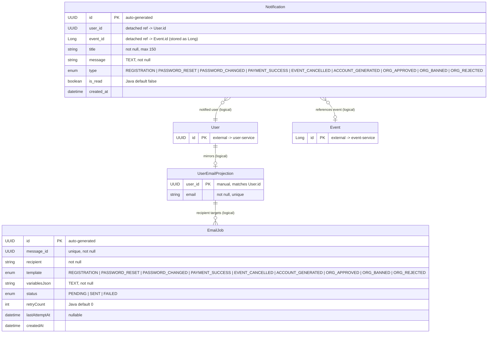

# Notification Service — Entity Relationship Diagram

**Database:** `notification_db` (PostgreSQL)
**Entities:** Notification, EmailJob, UserEmailProjection
**Pattern:** In-app notifications + async email queue + local read-model for user emails.

---

## ER Diagram



---

## Entity Definitions

### Notification (in-app)
| Column | Type | Constraints | Description |
|--------|------|-------------|-------------|
| id | UUID | PK, auto-generated | Notification ID |
| user_id | UUID | NOT NULL | Logical FK → User.id |
| event_id | BIGINT | nullable | Logical FK → Event.id (stored as Long) |
| title | VARCHAR(150) | NOT NULL | Notification title |
| message | TEXT | NOT NULL | Notification body |
| type | ENUM | NOT NULL | REGISTRATION, PASSWORD_RESET, PASSWORD_CHANGED, PAYMENT_SUCCESS, EVENT_CANCELLED, ACCOUNT_GENERATED, ORG_APPROVED, ORG_BANNED, ORG_REJECTED |
| is_read | BOOLEAN | NOT NULL (Java default false) | Read status, indexed via (user_id, is_read) |
| created_at | TIMESTAMP | NOT NULL | Auto-set by Hibernate |

### EmailJob (async email queue)
| Column | Type | Constraints | Description |
|--------|------|-------------|-------------|
| id | UUID | PK, auto-generated | Job ID |
| message_id | UUID | NOT NULL, UNIQUE | Deduplication / idempotency key |
| recipient | VARCHAR(255) | NOT NULL | Target email address |
| template | ENUM | NOT NULL | Email template identifier (9 values — incl. ORG_APPROVED, ORG_BANNED, ORG_REJECTED) |
| variables_json | TEXT | NOT NULL | JSON map of template variables |
| status | ENUM | NOT NULL | PENDING, SENT, FAILED |
| retry_count | INT | NOT NULL (Java default 0) | Retry attempt counter |
| last_attempt_at | TIMESTAMP | nullable | Most recent send attempt |
| created_at | TIMESTAMP | NOT NULL | Auto-set by Hibernate |

### UserEmailProjection (local read-model)
| Column | Type | Constraints | Description |
|--------|------|-------------|-------------|
| user_id | UUID | PK (manual) | Matches User.id from user-service |
| email | VARCHAR(255) | NOT NULL, UNIQUE | Denormalized user email address |

---

## Key Design Details

### UserEmailProjection — Local Read-Model
`UserEmailProjection` is a **denormalized local cache** of user email addresses:
- It is populated when consuming the `user.email-verification` Kafka event (writes the projection if missing)
- It eliminates synchronous Feign calls to user-service when sending notifications
- The PK `user_id` matches `User.id` exactly (manually assigned, same value)
- This is a classic **event-driven read-model** pattern (CQRS-lite)

### Two Notification Channels
| Entity | Channel | Delivery |
|--------|---------|----------|
| `Notification` | In-app | Stored in DB, fetched via REST API (`/api/v1/notification`) |
| `EmailJob` | Email (SMTP) | Queued in `email_jobs`, processed by `EmailScheduler` |

### EmailJob Processing Flow
```
PENDING -> SENT (success)
        -> FAILED -> retry (up to max)
                  -> PENDING (reset by recovery job)
```

### Notification Type / Template Mapping
| Kafka Event | Notification Type | Email Template |
|-------------|-------------------|----------------|
| `user.email-verification` | REGISTRATION | `email/registration` |
| `user.password-reset` | PASSWORD_RESET | `email/password-reset` |
| `user.password-change` | PASSWORD_CHANGED | `email/password-changed` |
| `reservation.completed` (success only) | PAYMENT_SUCCESS | `email/payment-success` |
| `payment.refunded` | EVENT_CANCELLED | `email/refund-completed` |
| `accounts.generated` | ACCOUNT_GENERATED | `email/account-generated` |
| `org.status.changed` | ORG_APPROVED / ORG_BANNED / ORG_REJECTED | `email/org-approved` / `email/org-banned` / `email/org-rejected` |

Template names in `NotificationTemplate` are used without the `.html` extension (resolved by the email sender). `reservation.completed` maps to PAYMENT_SUCCESS (only when `event.success() == true`); `org.status.changed` selects the template from the event's `status` field ("APPROVED"/"BANNED"/"REJECTED").

### Zero JPA Relationships
All three entities are standalone with **no** `@ManyToOne` or `@OneToMany` annotations. Cross-entity references are detached UUIDs. The notification service is designed to be fully independent of upstream services, communicating only via Kafka events and the local read-model.

---

## Relationship Summary

| Source | Target | Type | FK Field | Evidence |
|--------|--------|------|----------|----------|
| Notification | User (external) | Logical N:1 (UUID) | `userId` | `Notification.java:27-28` |
| Notification | Event (external) | Logical N:1 (Long) | `eventId` | `Notification.java:30-31` |
| UserEmailProjection | User (external) | Logical 1:1 (UUID as PK) | `userId` | `UserEmailProjection.java:17-19` |
| EmailJob | UserEmailProjection | Logical N:1 (String) | `recipient` → `email` | `EmailJob.java:33-34` |
