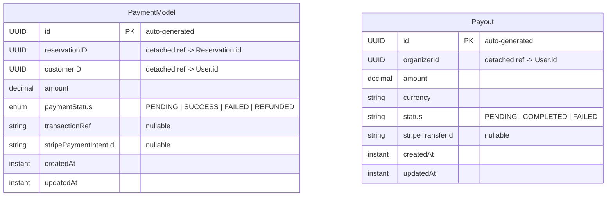

# Payment Service — Entity Relationship Diagram

**Database:** `payment_db` (PostgreSQL)  
**Entities:** PaymentModel, Payout  
**Relationship Style:** All cross-entity references are detached UUIDs — zero JPA relationships.

---

## ER Diagram



---

## Entity Definitions

### PaymentModel
| Column | Type | Constraints | Description |
|--------|------|-------------|-------------|
| id | UUID | PK, auto-generated | Payment record ID |
| reservationID | UUID | nullable | Logical FK → Reservation.id (saga correlation) |
| customerID | UUID | nullable | Logical FK → User.id (payer) |
| amount | DECIMAL | nullable | Payment amount |
| paymentStatus | ENUM | nullable | PENDING, SUCCESS, FAILED, REFUNDED |
| transactionRef | VARCHAR(255) | nullable | Provider transaction reference |
| stripePaymentIntentId | VARCHAR(255) | nullable | Stripe PaymentIntent ID |
| created_at | TIMESTAMP | | Auto-set by Hibernate `@CreationTimestamp` |
| updated_at | TIMESTAMP | | Auto-set by Hibernate `@UpdateTimestamp` |

### Payout
| Column | Type | Constraints | Description |
|--------|------|-------------|-------------|
| id | UUID | PK, auto-generated | Payout record ID |
| organizerId | UUID | nullable | Logical FK → User.id (org head receiving funds) |
| amount | DECIMAL | nullable | Payout amount |
| currency | VARCHAR(3) | nullable | Currency code (e.g. "USD") |
| status | VARCHAR(255) | nullable | Free-text status: PENDING, COMPLETED, FAILED |
| stripeTransferId | VARCHAR(255) | nullable | Stripe Transfer ID |
| created_at | TIMESTAMP | | Auto-set by Hibernate `@CreationTimestamp` |
| updated_at | TIMESTAMP | | Auto-set by Hibernate `@UpdateTimestamp` |

---

## Key Design Details

### Saga Correlation via `reservationID`
`PaymentModel.reservationID` links the payment to the **reservation-service** saga:
- The reservation service sends `saga.payment.command` → payment service processes → publishes `saga.payment.reply` back
- `reservationID` is the correlation ID across all saga steps

### Payment Lifecycle
```
PENDING -> SUCCESS -> REFUNDED
        -> FAILED
```

### Payout Status (String, not Enum)
`Payout.status` is a plain `String` rather than a Java enum, providing flexibility for provider-specific status values without code changes.

### Stripe Integration
| Field | Purpose |
|-------|---------|
| `stripePaymentIntentId` | Tracks the Stripe PaymentIntent for charge/refund operations |
| `stripeTransferId` | Tracks the Stripe Transfer for organizer payouts |
| `transactionRef` | Fallback generic reference if Stripe is not used (mock mode) |

### Zero JPA Relationships
Both `PaymentModel` and `Payout` are standalone entities with **no** `@ManyToOne` or `@OneToMany` annotations. Foreign keys (`reservationID`, `customerID`, `organizerId`) are detached UUIDs, keeping the payment service decoupled from upstream services.

---

## Relationship Summary

| Source | Target | Type | FK Field | Evidence |
|--------|--------|------|----------|----------|
| PaymentModel | Reservation (external) | Logical N:1 (UUID) | `reservationID` | `PaymentModel.java:29` |
| PaymentModel | User (external) | Logical N:1 (UUID) | `customerID` | `PaymentModel.java:30` |
| Payout | User (external) | Logical N:1 (UUID) | `organizerId` | `Payout.java:28` |
