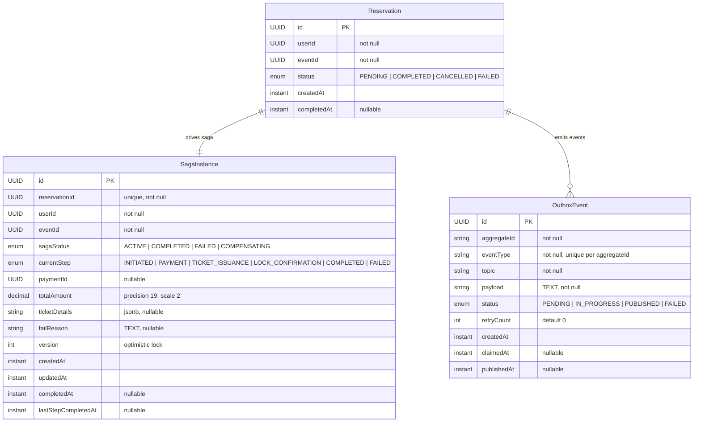

# Reservation Service — Entity Relationship Diagram

**Database:** `reservation_db` (PostgreSQL)  
**Entities:** Reservation, SagaInstance, OutboxEvent  
**Pattern:** Saga Orchestration + Outbox (no JPA relationships — all cross-entity references are detached UUIDs/Strings)

---

## ER Diagram



---

## Entity Definitions

### Reservation
| Column | Type | Constraints | Description |
|--------|------|-------------|-------------|
| id | UUID | PK (manual) | Reservation ID |
| user_id | UUID | NOT NULL | Purchasing user (detached ref) |
| event_id | UUID | NOT NULL | Target event (detached ref) |
| status | ENUM | NOT NULL | PENDING, COMPLETED, CANCELLED, FAILED |
| created_at | TIMESTAMP | | Auto-set by Spring Data |
| completed_at | TIMESTAMP | nullable | When final status was reached |

### SagaInstance
| Column | Type | Constraints | Description |
|--------|------|-------------|-------------|
| id | UUID | PK (manual) | Saga instance ID |
| reservation_id | UUID | NOT NULL, UNIQUE | Owning reservation (detached ref) |
| user_id | UUID | NOT NULL | Purchasing user (denormalized) |
| event_id | UUID | NOT NULL | Target event (denormalized) |
| saga_status | ENUM | NOT NULL | ACTIVE, COMPLETED, FAILED, COMPENSATING |
| current_step | ENUM | NOT NULL | INITIATED, PAYMENT, TICKET_ISSUANCE, LOCK_CONFIRMATION, COMPLETED, FAILED |
| payment_id | UUID | nullable | Stripe PaymentIntent ID (detached ref) |
| total_amount | DECIMAL(19,2) | nullable | Total reservation amount |
| ticket_details | JSONB | nullable | Snapshot of tickets to issue |
| fail_reason | TEXT | nullable | Failure description |
| version | INT | @Version | Optimistic locking counter |
| created_at | TIMESTAMP | | Auto-set by Spring Data |
| updated_at | TIMESTAMP | | Auto-set by Spring Data |
| completed_at | TIMESTAMP | nullable | Saga completion timestamp |
| last_step_completed_at | TIMESTAMP | nullable | Most recent step completion |

### OutboxEvent
| Column | Type | Constraints | Description |
|--------|------|-------------|-------------|
| id | UUID | PK (manual) | Outbox event ID |
| aggregate_id | VARCHAR(255) | NOT NULL | Logical FK → Reservation.id (as String) |
| event_type | VARCHAR(255) | NOT NULL, UNIQUE(aggregate_id, event_type) | Fully-qualified event class name |
| topic | VARCHAR(255) | NOT NULL | Target Kafka topic name |
| payload | TEXT | NOT NULL | Serialized JSON event body |
| status | ENUM | NOT NULL | PENDING, IN_PROGRESS, PUBLISHED, FAILED |
| retry_count | INT | NOT NULL, default 0 | Delivery attempt counter |
| created_at | TIMESTAMP | | Auto-set by Spring Data |
| claimed_at | TIMESTAMP | nullable | Worker claim timestamp |
| published_at | TIMESTAMP | nullable | Kafka publish timestamp |

---

## Enum Reference

### ReservationStatus (from `shared-module`)
```java
PENDING, COMPLETED, CANCELLED, FAILED
```

### SagaStatus
```java
ACTIVE, COMPLETED, FAILED, COMPENSATING
```

### SagaStep (Saga orchestrator step machine)
```java
INITIATED, PAYMENT, TICKET_ISSUANCE, LOCK_CONFIRMATION, COMPLETED, FAILED
```

### OutboxStatus
```java
PENDING, IN_PROGRESS, PUBLISHED, FAILED
```

---

## Relationship Summary

| Parent | Child | Type | FK Column / Field | Evidence |
|--------|-------|------|-------------------|----------|
| Reservation | SagaInstance | Logical 1:1 (UUID) | `SagaInstance.reservationId` | `SagaInstance.java:18-19` (@UniqueConstraint), `SagaInstance.java:33` (field) |
| Reservation | OutboxEvent | Logical 1:N (String) | `OutboxEvent.aggregateId` | `OutboxEvent.java:39` (field), `OutboxEvent.java:24-25` (@UniqueConstraint aggregateId + eventType) |

> **Note:** This service contains **zero JPA `@OneToMany`/`@ManyToOne` annotations**. All cross-entity references are **detached UUIDs or Strings** — a deliberate design choice to keep saga entities lightweight, avoid unintended cascade locking during distributed transactions, and maintain strict boundary separation. The Outbox pattern ensures reliable Kafka publishing without distributed transactions.
