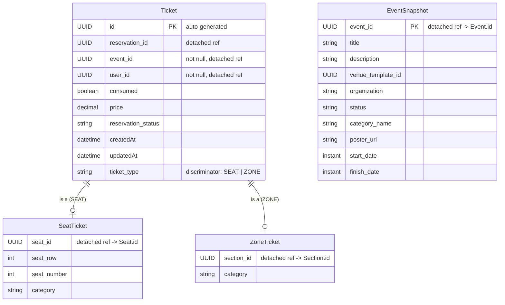

# Ticket Service — Entity Relationship Diagram

**Database:** `ticket_db` (PostgreSQL)  
**Entities:** Ticket (abstract), SeatTicket, ZoneTicket, EventSnapshot  
**Inheritance Strategy:** `SINGLE_TABLE` via discriminator column `ticket_type`

---

## Inheritance Note

`Ticket` is an **abstract entity** using JPA **SINGLE_TABLE** inheritance.  
Both `SeatTicket` and `ZoneTicket` subclass fields are stored in the single `tickets` table, differentiated by the `ticket_type` column (`"SEAT"` or `"ZONE"`).

**Physical table:** `tickets` — one table for all ticket types.  
**Logical model:** three Java entities — `Ticket` (base), `SeatTicket`, `ZoneTicket`.

---

## ER Diagram

---

## Entity Definitions

### Ticket (abstract base — table: `tickets`)
| Column | Type | Constraints | Description |
|--------|------|-------------|-------------|
| id | UUID | PK, auto-generated | Unique ticket ID |
| ticket_type | VARCHAR(31) | NOT NULL (discriminator) | `SEAT` or `ZONE` |
| reservation_id | UUID | nullable | Logical FK → Reservation.id |
| event_id | UUID | NOT NULL | Logical FK → Event.id |
| user_id | UUID | NOT NULL | Logical FK → User.id |
| consumed | BOOLEAN | NOT NULL | Whether ticket has been used |
| price | DECIMAL | nullable | Ticket price |
| reservation_status | VARCHAR(255) | nullable | Status copied from saga |
| created_at | TIMESTAMP | | Auto-set by Spring Data |
| updated_at | TIMESTAMP | | Auto-set by Spring Data |

### SeatTicket (discriminator `SEAT` — additional columns in `tickets`)
| Column | Type | Constraints | Description |
|--------|------|-------------|-------------|
| seat_id | UUID | nullable | Logical FK → Seat.id |
| seat_row | INT | nullable | Row number (denormalized) |
| seat_number | INT | nullable | Column/seat number (denormalized) |
| category | VARCHAR(255) | nullable | Category label |

### ZoneTicket (discriminator `ZONE` — additional columns in `tickets`)
| Column | Type | Constraints | Description |
|--------|------|-------------|-------------|
| section_id | UUID | nullable | Logical FK → Section.id |
| category | VARCHAR(255) | nullable | Category label (e.g. "VIP", "General") |

### EventSnapshot (table: `event_snapshots`)
| Column | Type | Constraints | Description |
|--------|------|-------------|-------------|
| event_id | UUID | PK (manual) | Logical FK → Event.id (same value) |
| title | VARCHAR(255) | nullable | Denormalized event title |
| description | TEXT | nullable | Denormalized event description |
| venue_template_id | UUID | nullable | Denormalized venue template ref |
| organization | VARCHAR(255) | nullable | Denormalized org name |
| status | VARCHAR(255) | nullable | Denormalized event status |
| category_name | VARCHAR(255) | nullable | Denormalized category name |
| poster_url | VARCHAR(255) | nullable | Denormalized poster URL |
| start_date | TIMESTAMP | nullable | Denormalized start date |
| finish_date | TIMESTAMP | nullable | Denormalized end date |

---

## Physical Table Layout — `tickets` (SINGLE_TABLE)

| ticket_type | id | reservation_id | event_id | user_id | consumed | price | seat_id | seat_row | seat_number | section_id | category |
|-------------|----|---------------|----------|---------|----------|-------|---------|----------|-------------|------------|----------|
| **SEAT** | U1 | R1 | E1 | U1 | false | 50.00 | S1 | 5 | 12 | `null` | "Standard" |
| **ZONE** | U2 | R2 | E1 | U2 | true | 100.00 | `null` | `null` | `null` | SEC1 | "VIP" |

> Columns `seat_id`, `seat_row`, `seat_number` are `null` for ZONE tickets.  
> Column `section_id` is `null` for SEAT tickets.

---

## Relationship Summary

| Parent | Child | Type | FK Column / Field | Evidence |
|--------|-------|------|-------------------|----------|
| Ticket (abstract) | SeatTicket | JPA Inheritance (SINGLE_TABLE) | discriminator `ticket_type = "SEAT"` | `Ticket.java:14-15`, `SeatTicket.java:9` |
| Ticket (abstract) | ZoneTicket | JPA Inheritance (SINGLE_TABLE) | discriminator `ticket_type = "ZONE"` | `Ticket.java:14-15`, `ZoneTicket.java:9` |
| Reservation (external) | Ticket | Logical N:1 (UUID) | `Ticket.reservationId` | `Ticket.java:28-29` |
| Event (external) | Ticket | Logical N:1 (UUID) | `Ticket.eventId` | `Ticket.java:31-32` |
| User (external) | Ticket | Logical N:1 (UUID) | `Ticket.userId` | `Ticket.java:34-35` |
| Seat (external) | SeatTicket | Logical 1:1 (UUID) | `SeatTicket.seatId` | `SeatTicket.java:16-17` |
| Section (external) | ZoneTicket | Logical N:1 (UUID) | `ZoneTicket.sectionId` | `ZoneTicket.java:16-17` |
| Event (external) | EventSnapshot | Logical 1:1 (UUID as PK) | `EventSnapshot.eventId` | `EventSnapshot.java:25-27` |
