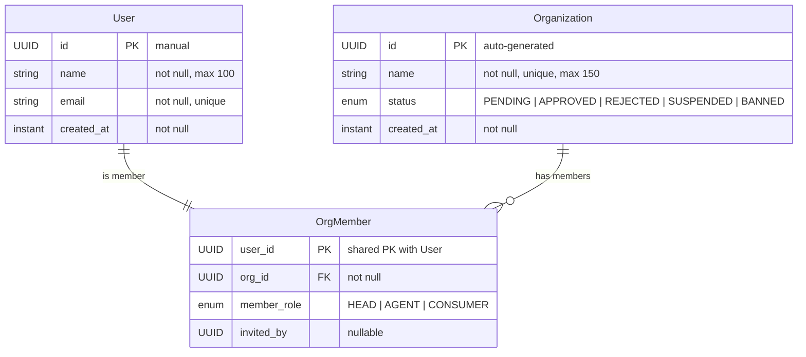

# User Service — Entity Relationship Diagram

**Database:** `user_db` (PostgreSQL)  
**Entities:** User, Organization, OrgMember

---

## ER Diagram



---

## Entity Definitions

### User
| Column | Type | Constraints | Description |
|--------|------|-------------|-------------|
| id | UUID | PK (manual) | User ID (created by API Gateway) |
| name | VARCHAR(100) | NOT NULL | User display name |
| email | VARCHAR(255) | NOT NULL, UNIQUE | User email address |
| created_at | TIMESTAMPTZ | NOT NULL | Set via @PrePersist |

### Organization
| Column | Type | Constraints | Description |
|--------|------|-------------|-------------|
| id | UUID | PK, auto-generated | Organization ID |
| name | VARCHAR(150) | NOT NULL, UNIQUE | Organization name |
| status | ENUM | NOT NULL | PENDING, APPROVED, REJECTED, SUSPENDED, BANNED |
| created_at | TIMESTAMPTZ | NOT NULL | Set via @PrePersist |

### OrgMember
| Column | Type | Constraints | Description |
|--------|------|-------------|-------------|
| user_id | UUID | PK, FK → User.id | Shared PK with User (via @MapsId) |
| org_id | UUID | NOT NULL, FK → Organization.id | Parent organization |
| member_role | ENUM | NOT NULL | HEAD, AGENT, CONSUMER |
| invited_by | UUID | nullable | User ID who invited this member |

---

## Key Design Details

### Shared Primary Key (`@MapsId`)
`OrgMember` uses JPA's `@MapsId` to share its primary key with `User`:
- `OrgMember.userId` is both the PK of `org_member` and a FK to `users.id`
- This enforces a **1:0..1** relationship — a user can have at most one OrgMember row
- No separate `org_member` ID column exists; the `user_id` IS the PK

### Member Roles
| Role | Description |
|------|-------------|
| HEAD | Organization owner/admin — can manage members, events, org settings |
| AGENT | Staff/agent — can manage events and tickets on behalf of the org |
| CONSUMER | Regular end-user buying tickets (no org management privileges) |

### Org Status Lifecycle
```
PENDING -> APPROVED -> SUSPENDED -> BANNED
                   -> REJECTED
```

---

## Relationship Summary

| Parent | Child | Type | FK Column | Source File |
|--------|-------|------|-----------|-------------|
| User | OrgMember | @OneToOne (shared PK) | `OrgMember.user_id` | `OrgMember.java:19-22` |
| OrgMember | Organization | @ManyToOne | `OrgMember.org_id` | `OrgMember.java:24-26` |
