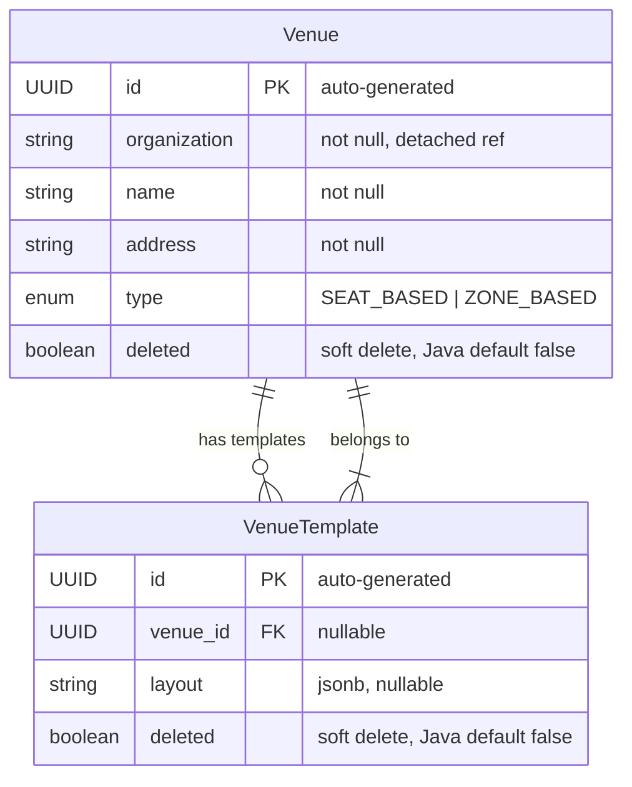

# Venue Service — Entity Relationship Diagram

**Database:** `venue_db` (PostgreSQL)  
**Entities:** Venue, VenueTemplate  
**Soft Delete:** Both entities use `@SQLRestriction("deleted = false")` — all queries automatically filter out soft-deleted rows.

---

## ER Diagram

---

## Entity Definitions

### Venue
| Column | Type | Constraints | Description |
|--------|------|-------------|-------------|
| id | UUID | PK, auto-generated | Venue ID |
| organization | VARCHAR(255) | NOT NULL | Logical FK → Organization.id (user-service) — stored as string (column `organization`) |
| name | VARCHAR(255) | NOT NULL | Venue name |
| address | VARCHAR(255) | NOT NULL | Physical address |
| type | ENUM | nullable | SEAT_BASED or ZONE_BASED |
| deleted | BOOLEAN | NOT NULL (Java default false) | Soft-delete flag |

### VenueTemplate
| Column | Type | Constraints | Description |
|--------|------|-------------|-------------|
| id | UUID | PK, auto-generated | Template ID |
| venue_id | UUID | nullable, FK → Venue.id | Parent venue |
| layout | JSONB | nullable | Full venue layout definition (sections, seats, zones) |
| deleted | BOOLEAN | NOT NULL (Java default false) | Soft-delete flag |

---

## Key Design Details

### Soft Delete via `@SQLRestriction`
Both entities use Hibernate's `@SQLRestriction("deleted = false")`:
- All `SELECT`, `UPDATE`, `DELETE` queries automatically append `WHERE deleted = false`
- Rows are never physically removed — only flagged
- To include soft-deleted rows, a separate query/method in the repository would be needed

### JSONB Layout Column
`VenueTemplate.layout` is stored as PostgreSQL `jsonb` via `@JdbcTypeCode(SqlTypes.JSON)`:
- Contains the complete section/seat/zone structure
- Used by the event-service to instantiate event layouts from templates
- The actual JSON schema includes `sections[]`, each with `name`, `capacity`, `seats[]` (for SEAT_BASED) or parameters (for ZONE_BASED)

### Venue Type
| Type | Description |
|------|-------------|
| SEAT_BASED | Individual numbered seats (rows + columns) |
| ZONE_BASED | General admission zones/areas (no assigned seats) |

### `organization` — Detached Reference
`Venue.organization` is a plain String holding `Organization.id` from the **user-service**. There is no JPA relationship — it is a logical foreign key only.

---

## Relationship Summary

| Parent | Child | Type | FK Column | Source File |
|--------|-------|------|-----------|-------------|
| Venue | VenueTemplate | @OneToMany | `VenueTemplate.venue_id` | `Venue.java:34-35` |
| VenueTemplate | Venue | @ManyToOne | `VenueTemplate.venue_id` | `VenueTemplate.java:24-26` |
