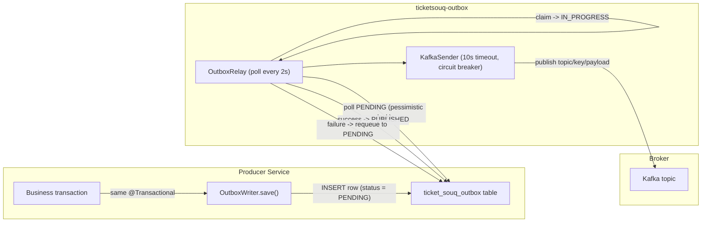
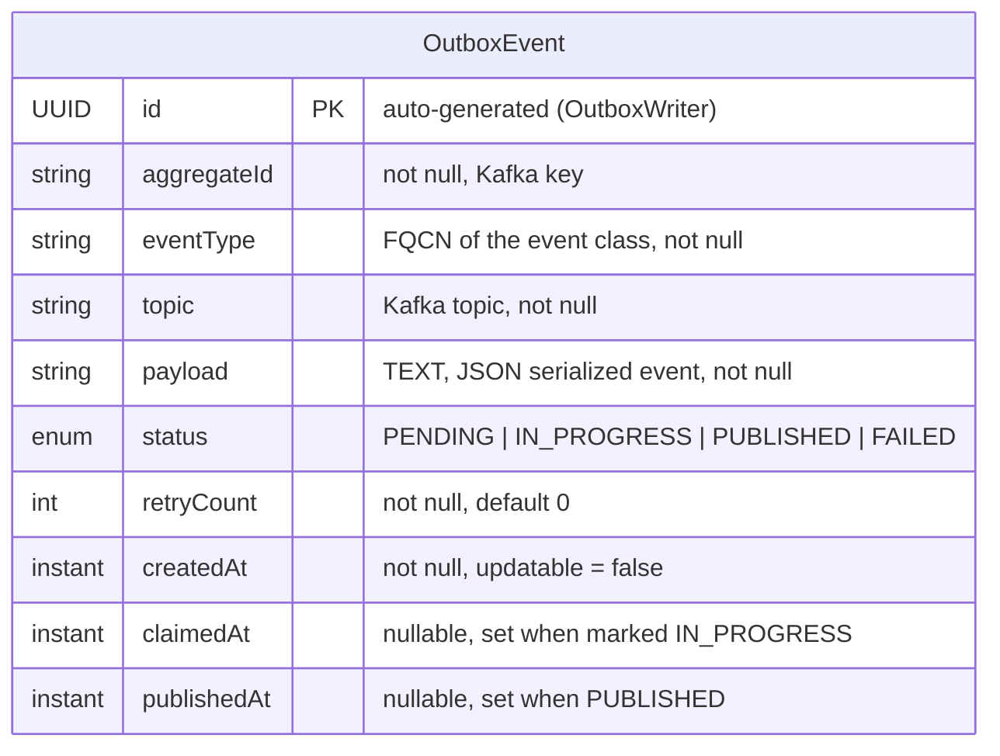
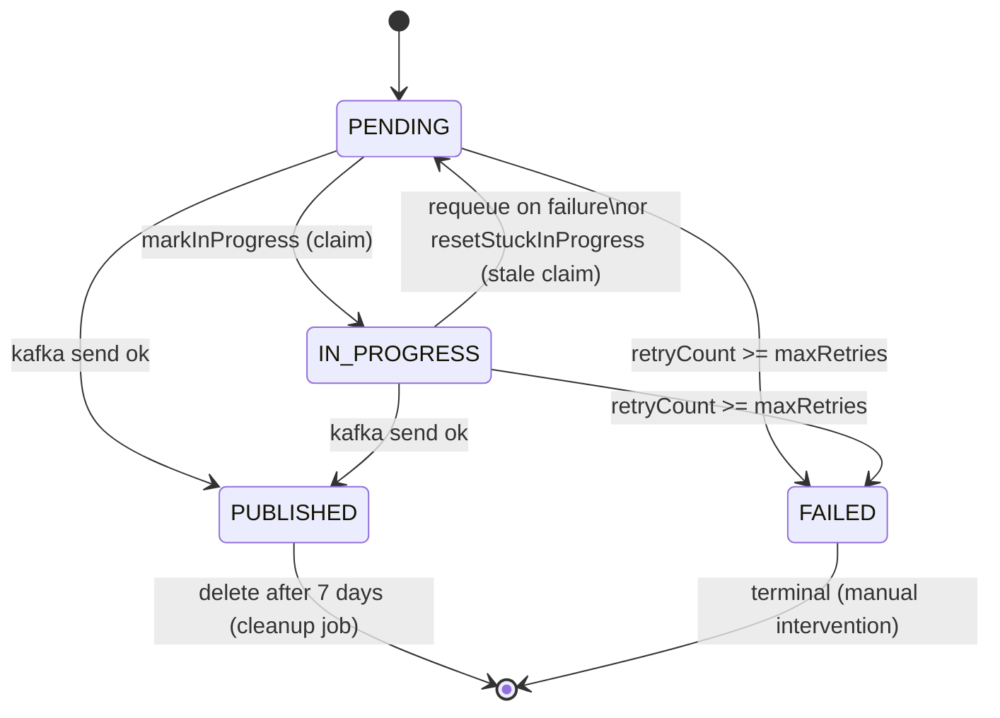

# Outbox Library — `ticketsouq-outbox`

A **transactional outbox** library JAR. Writes outgoing Kafka events to a DB table **in the same transaction** as the business change, then a background relay publishes them to Kafka. This guarantees at-least-once delivery without dual-write consistency gaps.

- **Module:** `ticketsouq-outbox` (parent: `TicketSouq`, `pom.xml:8-12`)
- **Dependencies:** `spring-boot-starter-data-jpa` (`pom.xml:17-20`), plus test-scoped `org.postgresql:postgresql` (`pom.xml:21-25`)
- **Not a Spring Boot application** — consumed as a library dependency by 6 services: `api-gateway`, `event-service`, `payment-service`, `reservation-service`, `ticket-service`, `user-service` (each declares it in its own `pom.xml`). `shared-module` is a library, not a consumer.

---

## How It Works (Flow)

---

## ER Diagram

---

## Entity Definition

### OutboxEvent — table `ticket_souq_outbox`

| Column | Type | Constraints | Description |
|--------|------|-------------|-------------|
| id | UUID | PK, auto-generated | Unique outbox row ID |
| aggregate_id | VARCHAR(255) | NOT NULL | Kafka message key (aggregate/business reference) |
| event_type | VARCHAR(255) | NOT NULL | Fully-qualified event class name, used to deserialize the payload |
| topic | VARCHAR(255) | NOT NULL | Kafka topic to publish to |
| payload | TEXT | NOT NULL | JSON-serialized event body |
| status | VARCHAR(20) | NOT NULL | `PENDING` \| `IN_PROGRESS` \| `PUBLISHED` \| `FAILED` |
| retry_count | INT | NOT NULL, default 0 | Publish attempt counter |
| created_at | TIMESTAMP | NOT NULL, immutable | Row creation time |
| claimed_at | TIMESTAMP | nullable | When a relay instance claimed the row (IN_PROGRESS) |
| published_at | TIMESTAMP | nullable | When the event was successfully published |

**Evidence source:** `ticketsouq-outbox/src/main/java/org/ticketsouq/outbox/entity/OutboxEvent.java:18-54` (`@Table(name = "ticket_souq_outbox")` at `:19`).

---

## Status Lifecycle

### Transitions (evidence)

| From | To | Trigger | Source |
|------|----|---------|--------|
| — → PENDING | `OutboxWriter.save()` inserts row with `status = PENDING` | `OutboxWriter.java:33` |
| PENDING → IN_PROGRESS | `repository.markInProgress()` optimistic CAS claim | `OutboxRelay.java:42`, `OutboxEventRepository.java:23-25` |
| * → PUBLISHED | `kafkaSender.send()` returns `true`; row set `PUBLISHED` + `publishedAt` | `OutboxRelay.java:47-48`, `:77-83` |
| IN_PROGRESS → PENDING | `requeue()` on failed send (circuit breaker open / Kafka unavailable) | `OutboxRelay.java:50, :53`, `:85-90` |
| IN_PROGRESS → PENDING | `resetStuckInProgress()` — stale claim (`retryCount < maxRetries`, `claimedAt` older than `staleMinutes`) | `OutboxRelay.java:35-36`, `OutboxEventRepository.java:27-29` |
| * → FAILED | `handleFailure()` — `retryCount >= maxRetries` | `OutboxRelay.java:92-104` |
| PUBLISHED → (deleted) | `cleanPublishedEvents()` daily cron, `publishedAt` older than 7 days | `OutboxRelay.java:61-66`, `OutboxEventRepository.java:31` |

---

## Component Reference

| Component | Package | Responsibility | Source |
|-----------|---------|----------------|--------|
| `OutboxWriter` | `service` | `@Transactional` append — serialize event, insert `PENDING` row | `service/OutboxWriter.java:24-38` |
| `OutboxRelay` | `relay` | `@Scheduled` poller — claim, publish, requeue, mark failed; nightly cleanup | `relay/OutboxRelay.java:32-66` |
| `KafkaSender` | `kafka` | Wraps `KafkaTemplate.send()` with 10s timeout + `@CircuitBreaker("outboxKafka")` | `kafka/KafkaSender.java:20-33` |
| `OutboxEventRepository` | `repository` | JPA queries: claim (pessimistic lock), mark in-progress, reset stale, purge published | `repository/OutboxEventRepository.java:17-31` |
| `OutboxProperties` | `relay` | `@ConfigurationProperties("app.outbox")` — poll interval, max retries, stale window | `relay/OutboxProperties.java:10-14` |
| `OutboxSqlStatementInspector` | `config` | Hibernate `StatementInspector` — suppresses outbox table SQL from logs | `config/OutboxSqlStatementInspector.java:18-24` |
| `OutboxJpaConfiguration` | `config` | `@EnableScheduling`, registers properties + statement inspector | `config/OutboxJpaConfiguration.java:11-29` |

---

## Configuration (`app.outbox.*`)

| Property | Default | Description | Source |
|----------|---------|-------------|--------|
| `app.outbox.poll-interval` | `2000` (ms) | Relay poll frequency (`@Scheduled(fixedDelayString)`) | `OutboxRelay.java:32`, `OutboxProperties.java:11` |
| `app.outbox.max-retries` | `5` | Max publish attempts before row is marked `FAILED` | `OutboxProperties.java:12` |
| `app.outbox.stale-minutes` | `5` | How old an `IN_PROGRESS` claim must be before `resetStuckInProgress()` re-queues it | `OutboxProperties.java:13` |

---

## Concurrency & Delivery Notes

- **At-least-once delivery:** a consumer may receive duplicates — the relay does not deduplicate. Idempotency is handled by consumers (e.g. `EmailJob.message_id`).
- **Single-writer claim:** `findByStatusOrderByCreatedAt()` uses `@Lock(PESSIMISTIC_WRITE)` with `lock.timeout = -2` (skip locked) so concurrent relay instances never claim the same row twice (`OutboxEventRepository.java:19-21`).
- **Crash recovery:** rows stuck in `IN_PROGRESS` past `staleMinutes` are reset to `PENDING` by the next poll if `retryCount < maxRetries`.
- **Cleanup:** `PUBLISHED` rows are purged daily by `cleanPublishedEvents()` after 7 days.
- **Table location:** each consuming service carries its own `ticket_souq_outbox` table in its own database — there is no shared physical table.
